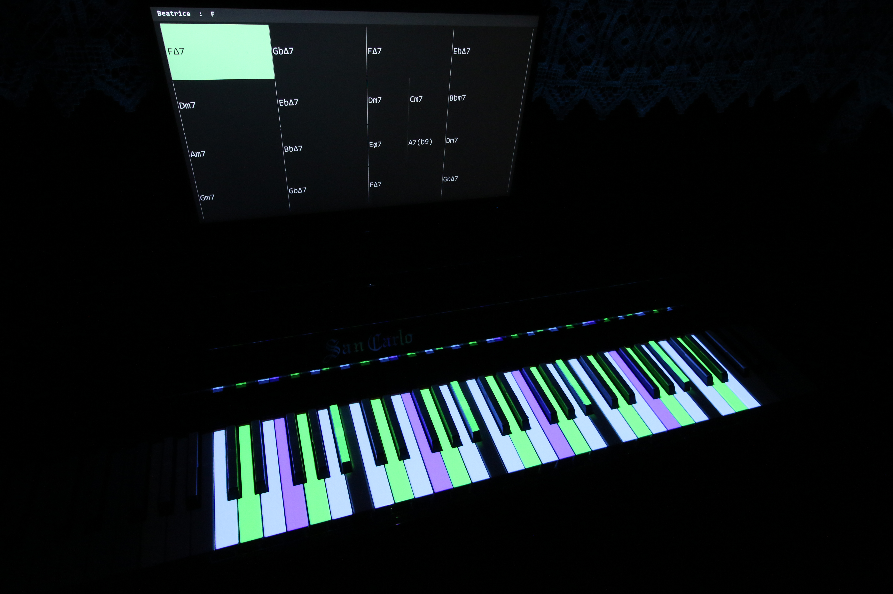

# Controls

Key handling: [src/leadsheet_utility/gui/input.py](src/leadsheet_utility/gui/input.py) (main app), [src/leadsheet_utility/calibration/ui.py](src/leadsheet_utility/calibration/ui.py) (calibration).

## Main application

### Transport

| Key | Action |
|---|---|
| `Space` | Play / pause (exits frozen mode, restarts from top) |
| `S` | Stop |
| `O` | Open lead sheet |
| `1`-`5` | Select exercise: Free / Guide Tone / Contour / Flow / Start & End |
| `+` / `-` | Tempo +/- 5 BPM (next play re-renders audio) |
| `C` | Enter calibration |
| `Q` / `Esc` | Quit |

### Backing track

| Key | Action |
|---|---|
| `M` | Toggle metronome |
| `G` | Cycle density: NONE / DRUMS / DRUMS_BASS / FULL |

### Projection (all exercises)

| Key | Action |
|---|---|
| `B` | Cycle range: FULL / R.HAND / 2-OCT / 1-OCT |
| `T` | Cycle chord tones: OFF / ONLY / OVERLAY |
| `R` | Toggle root overlay (blue) |
| `A` | Cycle anticipation: OFF / 8TH / QUARTER |
| `F` | Frozen mode (pin projection to one chord) |
| `←` / `→` | Step chord in frozen mode |

### Per-exercise

| Key | Action |
|---|---|
| `H` | Guide Tone: cycle path (3rd / 7th) |
| `↑` / `↓` | Guide Tone: octave shift |
| `N` | Guide Tone: next-chord preview (orange) |
| `W` | Contour: width NARROW / MEDIUM / WIDE |
| `X` | Contour: speed SLOW / MEDIUM / FAST |
| `Shift+W` | Contour: re-roll curve |
| `D` | Flow: phrasing SHORT / MEDIUM / LONG |
| `P` | Start & End: phrase length 2 / 4 / 8 bars |
| `Shift+P` | Start & End: re-roll picks |

### Loop practice

| Key | Action |
|---|---|
| `L` | Enter loop selection on the chart |
| `Alt+←` / `Alt+→` | Slide the band |
| `Shift+←` / `Shift+→` | Shrink / expand the band |
| `Enter` | Confirm and loop |
| `K` | Clear / cancel |

## Calibration

Five phases. `Enter` advances (saves after the last), `Esc` cancels. Result persisted to `data/calibration.json`.

### 1. Range (projector reach)

| Input | Action |
|---|---|
| `Tab` | Toggle low / high endpoint |
| `←` / `→` | Move endpoint (`Shift` = larger step) |
| `R` | Reset |

### 2. Markers + black-key ratios

| Input | Action |
|---|---|
| Mouse drag | Move marker |
| `Tab` / `Shift+Tab` | Cycle marker |
| `1`-`4` | Jump to marker (TL, TR, BR, BL) |
| Arrows | Nudge 1 px (`Shift` = 10 px) |
| `Q` / `W` | Black keys narrower / wider (`Shift` = x5) |
| `A` / `S` | Black keys shorter / longer (`Shift` = x5) |
| `R` | Reset markers |

### 3. Per-black-key tuning

Active key drawn yellow; fixes residual drift the homography can't model.

| Input | Action |
|---|---|
| `Tab` / `Shift+Tab` | Next / previous black key |
| Arrows | Nudge 1 px (`Shift` = 10 px) |
| `R` | Reset all offsets |

### 4. Exercise bands (1-OCT / 2-OCT)

| Input | Action |
|---|---|
| `B` | Switch band (2-OCT / 1-OCT) |
| `Tab` | Toggle low / high endpoint |
| `←` / `→` | Move endpoint (`Shift` = larger step) |
| `R` | Reset band |

### 5. Audio delay

| Input | Action |
|---|---|
| `↑` / `↓` | +/- 1 ms (`Shift` = 10 ms) |
| `R` | Reset to 0 |
| `Enter` | Confirm and save |

## Displays

- Three windows: HUD on display 0, chart on display 1 (3+ displays, else primary), projection fullscreen on the last. Override: `HUD_DISPLAY` / `CHART_DISPLAY` / `PROJ_DISPLAY=<index>`.
- Windows: `Win+Shift+←/→` moves the borderless projection window between monitors.
- Disable keystone correction in the projector OSD; the app's homography must be the only transform.
