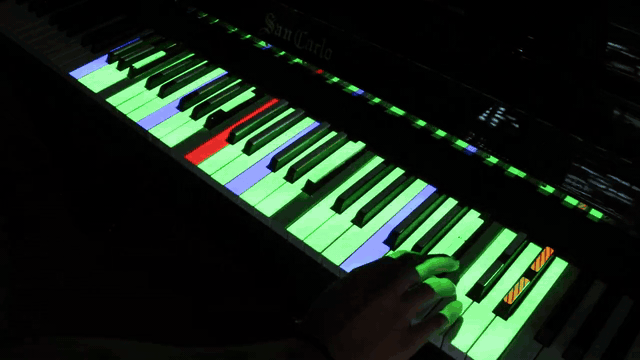

# leadsheet-utility

An augmented-reality piano for learning jazz improvisation. A projector above the keyboard lights up the right notes in real time (chord-scales, guide tones, target notes), synchronized with an auto-generated swing backing track (walking bass, drums, guitar comping). Everything is driven by an automatic harmonic analysis of the lead sheet.



Played in a dark room: light adds meaning to the useful keys (augmented reality), darkness removes the wrong ones (diminished reality). The goal is to offload the "which notes are correct right now?" question so the player's attention goes to the creative part.

## University project

Bachelor's project in Information Systems and Service Science, Centre Universitaire d'Informatique, University of Geneva. Supervised by Prof. Patrick Roth, defended June 2026.

Research question: can augmented and diminished reality on a piano support melodic jazz improvisation in a realistic context (scrolling grid, backing track, multiple keys)? Evaluated with an expert interview and a within-subject study (n = 8): NASA-TLX, STAI-6, self-efficacy. Results show moderate-to-large effect-size trends in the predicted direction, none significant at n = 8.

- Report (French): [docs/Projet de Bachelor - Alexandre RIEDO.pdf](docs/Projet%20de%20Bachelor%20-%20Alexandre%20RIEDO.pdf)
- Slides: [docs/deck.pdf](docs/deck.pdf)
- Design reference: [SPEC.md](SPEC.md)

## Features

- Automatic harmonic analysis: chord symbols resolved to chord-scales in pure Python, with 7 context rules (V7 to minor, tritone subs, ii-V chains, etc.). One analysis drives both lights and accompaniment.
- Five exercises from jazz pedagogy: Free Mode (the chord-scale), Guide Tone (voice-led 3rd/7th line), Contour (a lit window drifts across the keyboard), Flow (projection gates on/off to force phrasing), Start & End Note (entry and target note per phrase).
- Algorithmic backing track: walking bass, swing drums, drop-2/drop-3 guitar comping, metronome. Rendered offline with FluidSynth as four parallel layers; toggling instruments remixes instantly.
- Adjustable difficulty: highlight range, chord-tone and root overlays, backing density, tempo, next-chord anticipation, frozen mode.
- Loop practice: select a bar range on the chord chart, loop it with fresh backing each pass.
- Homography-based projection: 5-phase calibration maps the canonical keyboard onto your piano via OpenCV, once per physical setup.
- 21 standards included in [data/leadsheets/](data/leadsheets/).

All keyboard shortcuts: [CONTROLS.md](CONTROLS.md). Example walkthrough: [TUTORIAL.md](TUTORIAL.md).

## Installation

Requirements: Python 3.13+, [Poetry](https://python-poetry.org/), FluidSynth system library (Windows: `choco install fluidsynth`; Debian/Ubuntu: `apt install libfluidsynth3`), a projector as secondary display.

```bash
poetry install
```

Uses pygame-ce, which conflicts with standard pygame: don't install both.

## Running

```bash
# Main app (from src/: the project is not installed as a package)
cd src
poetry run python -m leadsheet_utility

# Previews (from repo root)
poetry run python scripts/preview_projector.py
poetry run python scripts/preview_calibration.py

# Tests and lint
poetry run pytest
poetry run ruff check .
```

First run: `C` to calibrate (saved to `data/calibration.json`, gitignored), `O` to open a lead sheet, `Space` to play.

Lead sheet format and architecture details: [SPEC.md](SPEC.md).

## License

MIT
