# Questions générales
## QR
- QR actuel (à revoir)
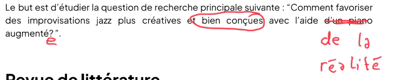

## Quoi évaluer?
- Quoi evaluer? 
    -   La "qualité" musicale de l'impro? 
    -   Le rapport/usage de l'outil informatique, s'ils se perdent dans le UI pygame? 
    -   Le rapport/usage de l'outil de projection, comment la projection leur affecte? Charge mentale réduite ? Utilité pour naviguer une grille? Trop de complexité où assez simple pour être utile ?
    -   Les jeux: enrichissant pour faire du jazz ou hors-contexte ? Utilité pratique ? Pour quel niveau d'utilisateur ?

# Evaluation à voix haute (pour des protos, mais pk pas?)
## Idées de déroulement général
Déroulement des tests au CPMDT?
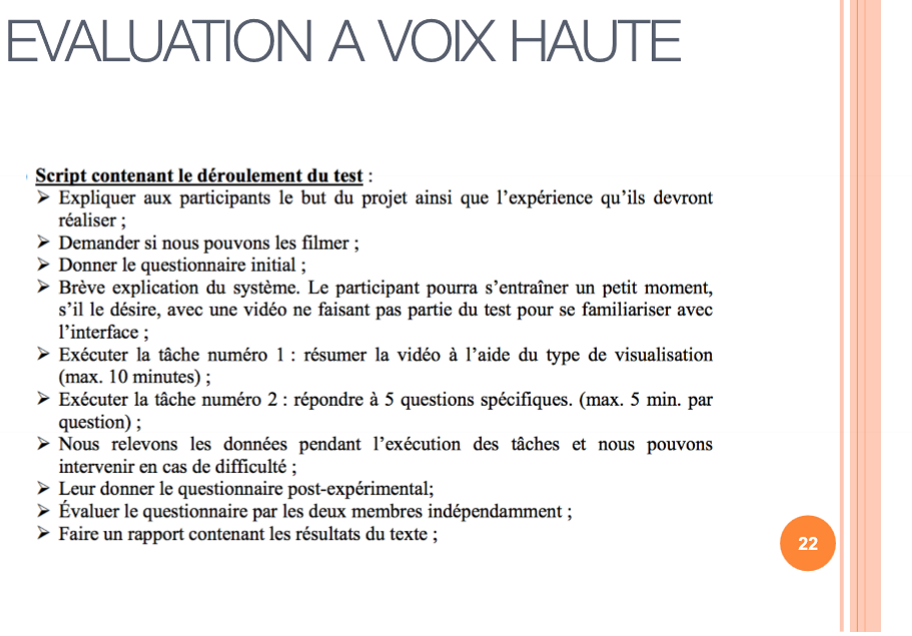

Plan exp?
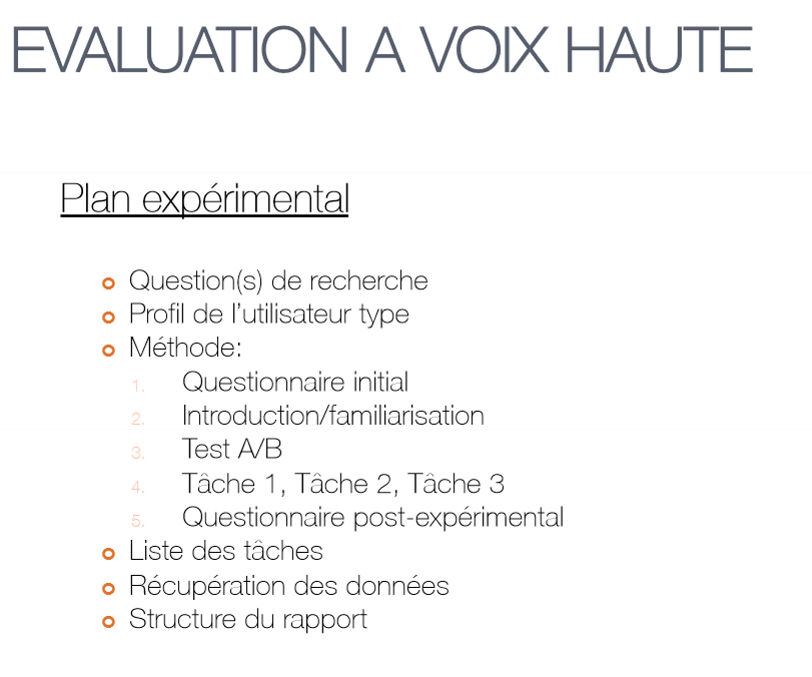

# Tâches/Tests à faire?
Que sont ces tests?
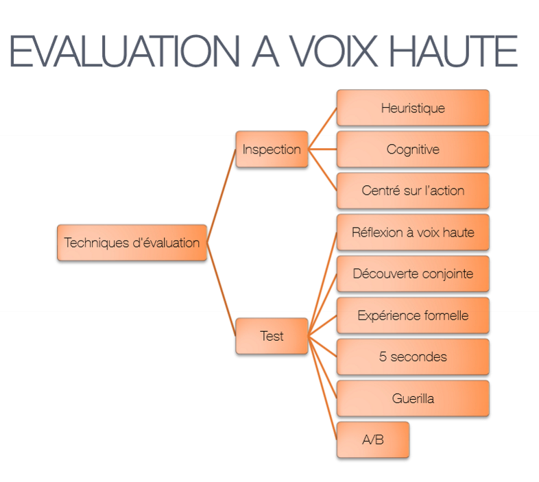

Faire des tâches avec les jeux? (mais comment mesurer le succès???)
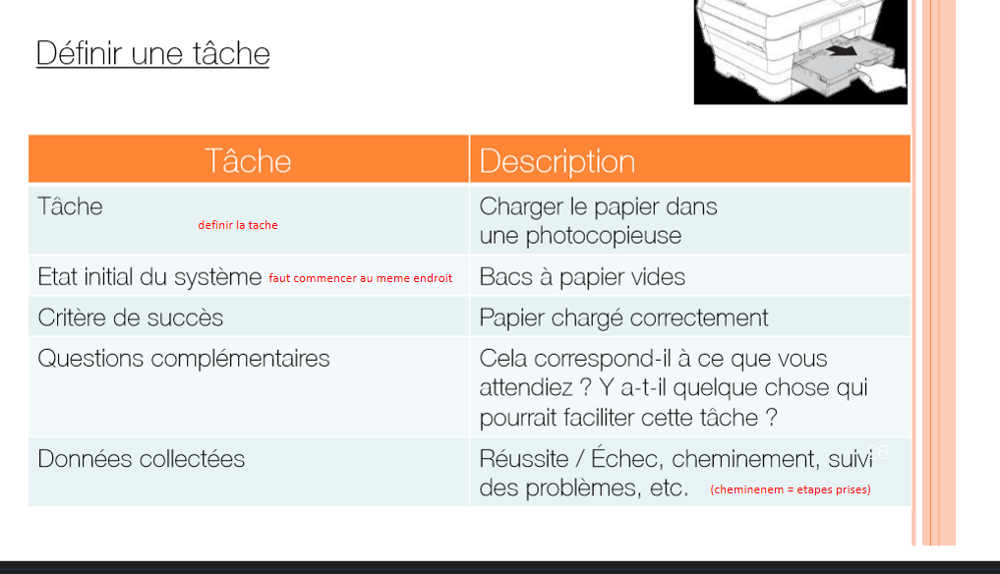

# Utilisabilité
## Questionnaires post-exp
Exemple de questionnaire post-exp?
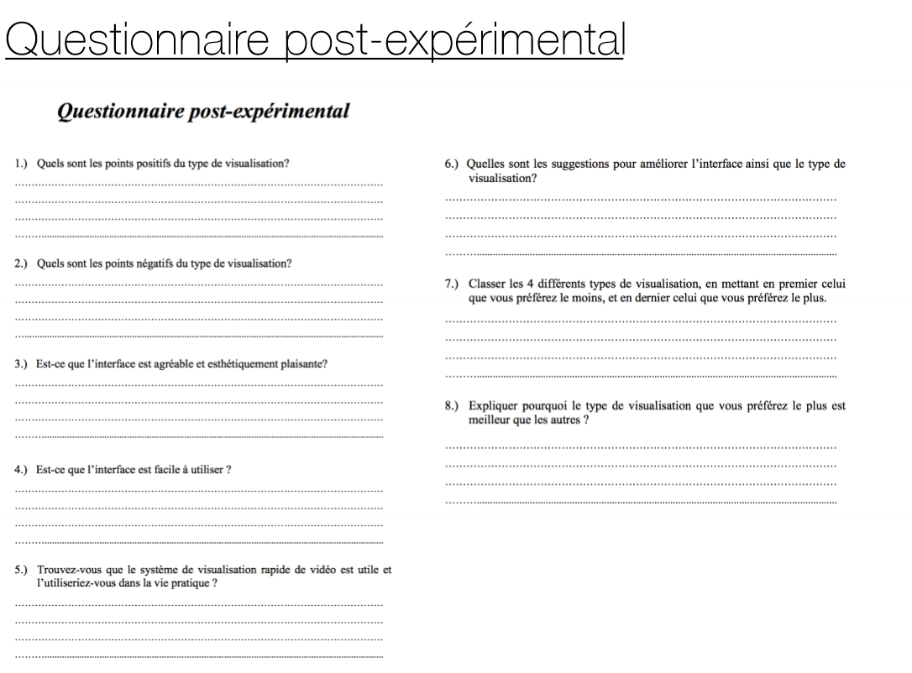

Faire un SUS?
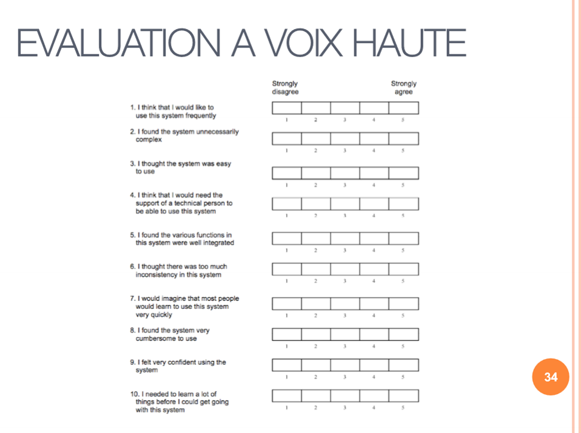

Autres types de questionnaires post-exp?
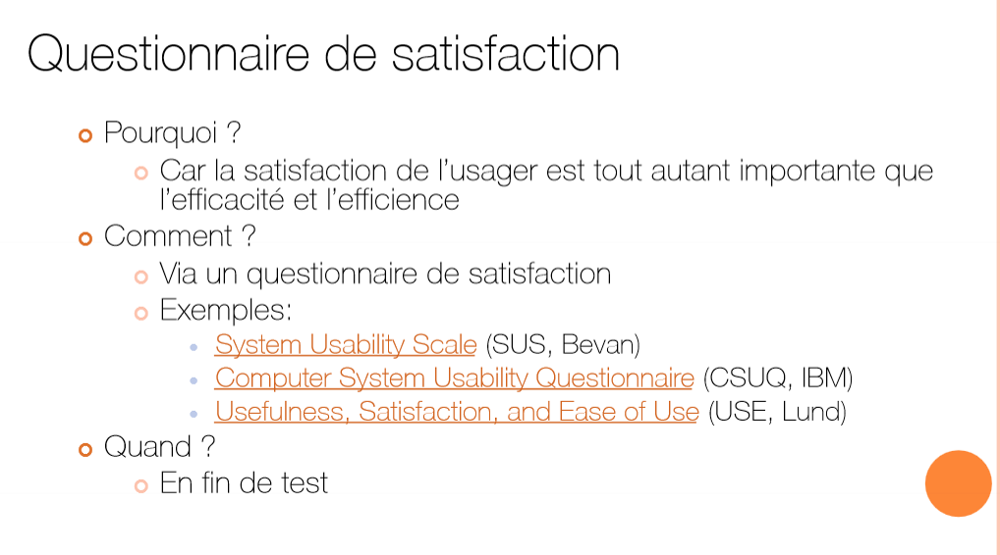

## Tests d'utilisabilité
Faire le "sommatif"
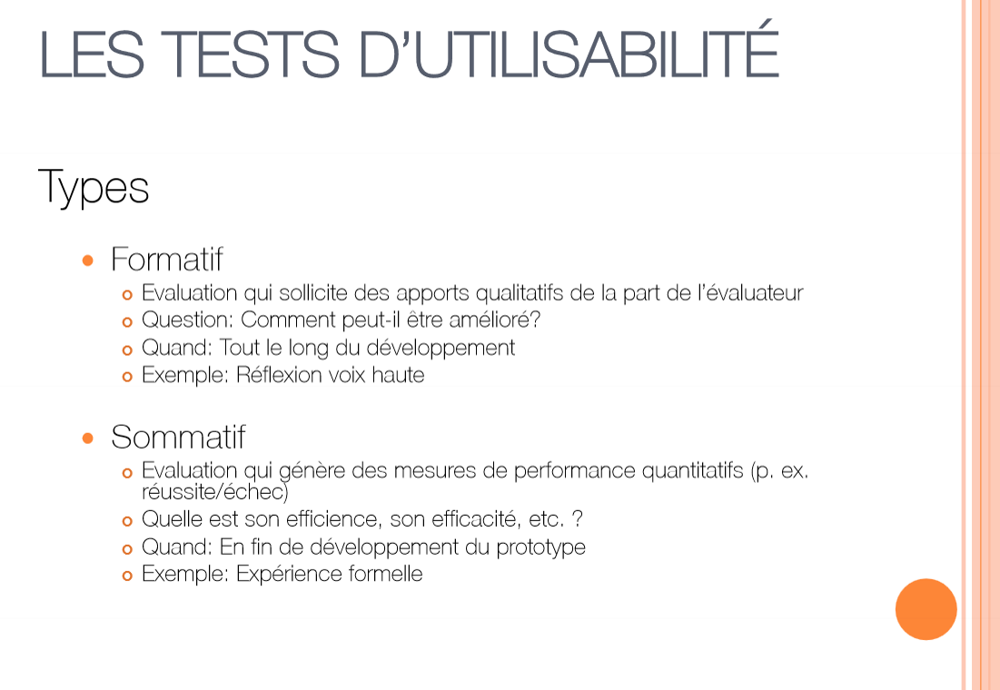

Tests pilote "réalisés"
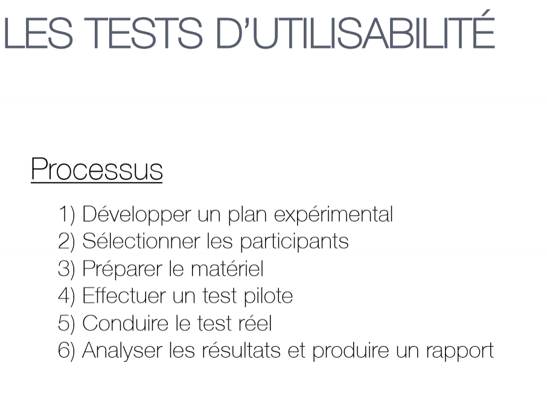

Faire un attrakdiff?
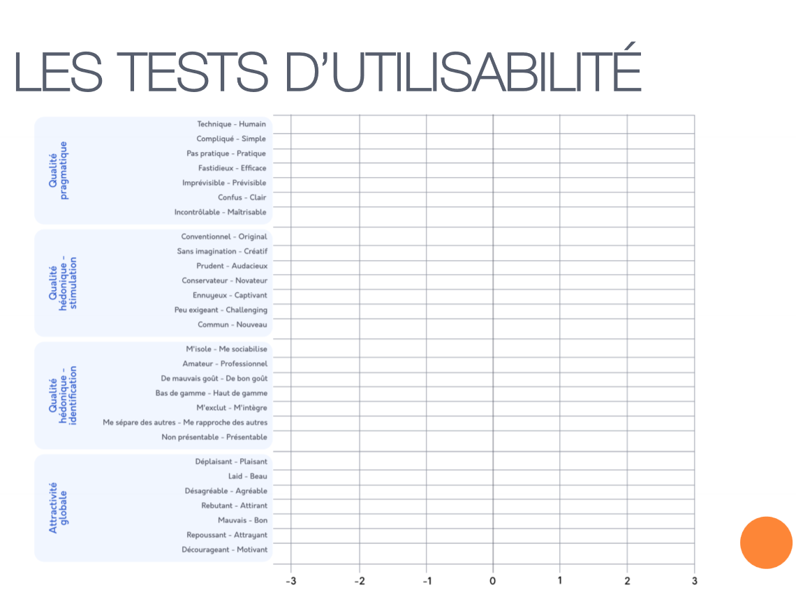

Le résumé
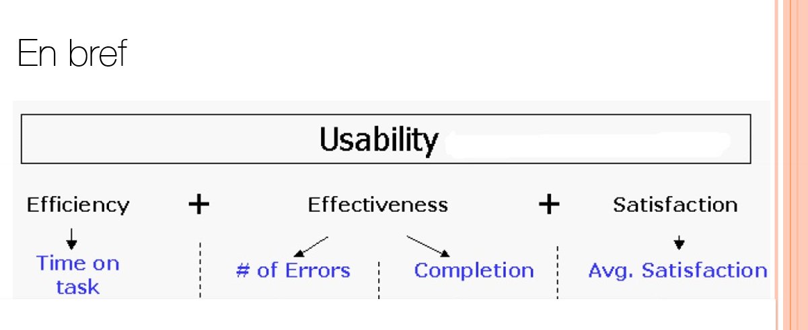