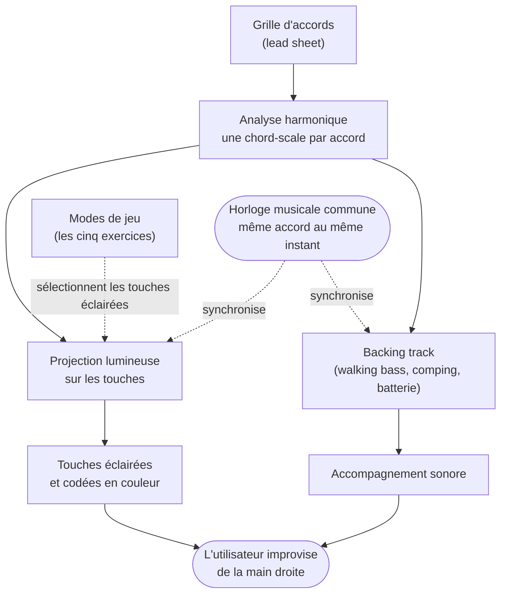

# Plan détaillé — Chapitre "Solution conceptuelle"

> But de ce document : un plan rédactionnel du chapitre 3 "Solution conceptuelle",
> calé sur le gabarit des quatre thèses de référence (lues en détail) et sur les notes
> de réunion de Patrick. Complète le squelette §4 de `plan-redaction.md`. Contient des
> blocs de prose déjà rédigés (en `> blockquote`) à reprendre tels quels ou à filtrer.
>
> Style : "nous" / "on", **pas de tirets cadratins ni demi-cadratins** (":" , virgules,
> parenthèses à la place), guillemets droits, termes jazz anglais en *italique*
> (*lead sheet*, *backing track*, *chord-scale*, *changes*, *guide tones*, *target notes*,
> *comping*). Cible : **8-10 pages** (budget `plan-redaction.md`).
>
> Vérifié le 2026-06-23 contre les 4 PDF de `rapport/refs/`, le DS (`rapport/ds/`),
> et le draft existant (PDF du master Google Doc).

---

## 0. Ce que font les thèses de référence dans leur chapitre conceptuel (le gabarit)

Les quatre thèses (toutes supervisées par Patrick Roth) ont la même ossature en deux
chapitres : **un chapitre conceptuel** (le QUOI + le POURQUOI + à quoi ça ressemble) puis
**un chapitre de réalisation** (le COMMENT : architecture, code, déploiement). Le chapitre
conceptuel n'est pas abstrait : il descend dans la **substance de l'artefact** et **inclut
le design visuel** (interface, code couleur) avec captures et justification.

| Thèse | Titre du chap. conceptuel | Contenu | À emprunter |
|---|---|---|---|
| **Mehmeti** (même superviseur, master, jeu sur grille : **le plus proche**) | "Modèle de solution" | Problématique de la grille → Choix du jeu → Règles & présentation de la grille → **Sonification du jeu** (le design central) | L'ordre **problème → ingestion → présentation → design du cœur**. C'est notre squelette |
| **Carusi** (même superviseur, réf. citée par Patrick) | "Proposition" | Principe + **Fig.2 modélisation conceptuelle** (entités/relations) + liste de fonctionnalités + **"Règles de détection"** (la substance, concrète : nomme `tabIndex`, ARIA, ratios WCAG) + **"Prototype interactif"** (captures + **palette couleur justifiée**) | Le **diagramme de modélisation conceptuelle**, le bloc substance concret, le sous-bloc **prototype/couleur** |
| **Courtin** (même superviseur) | "Proposition conceptuelle" | 1 paragraphe + **Fig.7 schéma de proposition** (haut niveau) + **Champ d'application** (périmètre) + **Démarche** (briques conceptuelles, un schéma par brique) | Le **schéma de proposition** d'ouverture + la section **champ d'application** |
| **Huynh** (même domaine, musique) | "Proposition" + "Prototype Design" | Décompose en modules (un schéma d'algo par module) + théorie (Berkemeier, Plutchik) + **sondage couleur** + captures d'interface **couleur** | Le modèle "**un module = un encart**" et le fait que **le code couleur se justifie ici** |

**Trois constats qui tranchent notre débat sur la frontière :**

1. **La couleur est un sujet du chapitre conceptuel.** Carusi justifie sa palette (blanc +
   camaïeu de vert) dans "Prototype interactif", Huynh fait un sondage chord-couleur, Mehmeti
   conçoit son mapping sonore. Notre code couleur (root/gamme/*chord tones*) va donc en §3,
   pas en §4 technique.
2. **Le chapitre conceptuel a le droit d'être concret.** Carusi nomme des propriétés CSS et
   des attributs ARIA dans sa "Proposition". La frontière n'est pas le niveau d'abstraction,
   c'est le **sujet** (design vs construction). Nous pouvons donc nommer les couleurs, les
   trois schémas, la valeur d'anticipation, sans descendre dans le code.
3. **L'interface/les captures vont dans le conceptuel** (Carusi "Prototype interactif",
   Huynh "Prototype Design"). Le display iReal et les photos de projection ont leur place ici.

---

## La frontière §3 conceptuel / §4 technique (règle d'arbitrage)

**§3 conceptuel = le design : ce que l'artefact fait, pourquoi, à quoi ça ressemble.**
**§4 technique = la construction : comment c'est assemblé (architecture, pipeline, code).**

Le draft actuel met déjà beaucoup de "ce que fait l'artefact" en §4 (overlays, projection,
GUI, chart). **Ne pas supprimer, mais répartir par altitude** (c'est exactement ce que fait
Carusi : "Prototype interactif" en Proposition vs "Frontend > Interface" en Implémentation,
la même UI à deux altitudes) :

| Sujet | §3 conceptuel (design + pourquoi) | §4 technique (construction) |
|---|---|---|
| Analyse harmonique | du chiffrage à la *chord-scale*, conscience du contexte (principe) | cascade de 7 règles, pré-passe chaînes, mod-12, `fichier:ligne` |
| Code couleur | le vocabulaire (root=bleu, gamme=vert, *chord tones*=bleu clair…) + pourquoi | `render_canonical`, surface 1920×200, surbrillances |
| 3 schémas de projection | l'échelle d'aide progressive (= séquence AVEC des tests) | pipeline d'overlays composables, ordre, `apply_*` |
| Anticipation | réponse à la charge "anticiper l'accord suivant" (QR1) | lead matériel 160 ms, décalage musical, math du *look-ahead* |
| Display iReal | représentation conventionnelle + pont grille→projection (lisibilité) + base de comparaison (condition SANS) | fenêtre, auto-échelle, bande de boucle, placement multi-écran |
| Registres (R.HAND / 1-2 OCT) | restreindre le champ : focus main droite, densité visuelle | calcul des bandes, `_range_midis`, clamp calibré |
| Densité accompagnement | retirer des couches = doser l'info sonore (pédagogie) | `BackingMode`, `mix_layers`, splice du playhead |
| Frozen / Boucle | modes de pratique : étude statique, drill d'un passage | forme temporaire, `wrap_around`, re-render, remix |
| Backing track | pourquoi un contexte musical (pédagogie) | génération algorithmique basse/comping/batterie, FluidSynth |
| Corpus de grilles | études (vamp, ii-V-I 12 tons) + standards gradués par difficulté | format TSV, parsing, tiers de nommage `drill_`/`easy_`/… |
| OMR | rôle conceptuel + pourquoi on y a renoncé | (rien : non intégré) |

---

## Légende d'arbitrage (altitude de chaque morceau)

Même système que `plan-solution-technique.md`, adapté au chapitre conceptuel :

- **[corps]** : prose du chapitre. Réservé aux éléments qui portent un **argument** (lien QR,
  pédagogie, cadre AR/DR, validation du professeur). Un paragraphe = un concept.
- **[table]** : entre dans le **tableau récapitulatif** (§3.9), pas en prose. Sert le "indiquer
  tout ce qui a été fait" de Patrick sans gonfler le texte.
- **[annexe]** : énumérations exhaustives, valeurs exactes des réglages, raccourcis clavier.
  Renvoyées à un guide utilisateur en annexe.

**Règle :** une feature ne gagne un paragraphe de prose que si elle porte un concept distinct ;
sinon, une ligne de tableau. Les **variantes d'un même mode** (largeurs, longueurs, vitesses)
sont des [table]/[annexe], jamais des [corps].

---

## Structure proposée du chapitre

Ordre calé sur Mehmeti (problème → ingestion → présentation → cœur) et sur les puces de
Patrick : "montrer le diagramme / analyse automatique → grille / OMR / indiquer tout ce qui
a été fait".

### 3.1 Objectifs et principe de base  [corps]

- **Contenu :** démarrer par les objectifs (les "Objectif BI 1/2" du diagramme d'exigences
  du DS), puis le principe en un paragraphe, puis le cadre augmentée/diminuée.
- **Prose :**

  > Notre artefact est un système de piano augmenté pour l'entraînement à l'improvisation
  > jazz. Le principe tient en une phrase : nous lisons une grille d'accords, nous analysons
  > son harmonie pour en déduire la gamme de chaque accord, et nous projetons cette
  > information directement sur les touches du piano, en temps réel et synchronisée à un
  > *backing track* généré. L'utilisateur improvise de la main droite en suivant les touches
  > éclairées, déchargé du calcul mental de la gamme de chaque accord.
  >
  > Le titre de ce travail parle de réalité augmentée et diminuée, et cette dualité décrit
  > d'abord, littéralement, le dispositif optique. L'artefact s'utilise dans une pièce sombre :
  > sans projection, l'utilisateur ne distingue presque plus son clavier. Cette obscurité est
  > notre réalité diminuée : elle soustrait du champ visuel toutes les touches dont
  > l'utilisateur n'a pas besoin, qui cessent simplement d'exister à ses yeux. Le projecteur
  > vient ensuite éclairer les seules touches utiles et leur ajoute un code couleur porteur de
  > sens : c'est la réalité augmentée, du contenu virtuel posé sur les touches réelles.
  > Concrètement : là où un clavier ordinaire présente 88 touches identiques à trier
  > mentalement, l'utilisateur n'a plus sous les yeux qu'une poignée de touches éclairées, déjà
  > sélectionnées et codées. La réduction du champ visuel est, en soi, une réduction de la
  > charge cognitive : c'est le mécanisme de base sur lequel reposent tous les modes de jeu.
  >
  > Nos exercices ne font ensuite que moduler cet équilibre. Certains poussent l'augmentation
  > au maximum (le mode libre éclaire toute la gamme) ; d'autres prolongent au contraire la
  > réalité diminuée en éteignant des touches pourtant déjà allumées, comme le mode Contour qui
  > ne garde qu'une fenêtre glissante ou le mode Flow qui replonge tout dans le noir pendant
  > les silences imposés.

- **Figure :** aucune (texte d'ouverture).
- **Référence :** Carusi ouverture de "Proposition" ; Courtin ouverture de §3 ; DS p.7-8.

### 3.2 Vue d'ensemble : le diagramme du système et le flux analyse → grille  [corps]

- **Contenu :** la pièce que Patrick réclame en premier. Trois figures :
  1. le **schéma du système** (projecteur surplombant le piano + ordinateur). **À produire :
     ce schéma n'est pas dans le DS** (le DS ne contient que le diagramme des exigences, sa
     Fig.1, et la photo du système de Sandnes/Eika, sa Fig.2 ; il n'y a pas de Fig.3). Soit
     un dessin à faire, soit le remplacer par une photo réelle du montage (cf. §3.8) ;
  2. le **diagramme des exigences** (DS Fig.1, déjà fait) : finalité (développer les capacités
     d'improvisation jazz au piano) → objectifs BI 1 (fournir un environnement de piano
     augmenté) et BI 2 (proposer des jeux d'improvisation utilisant la projection) → exigences
     fonctionnelles F1-F7 (lire un *lead sheet*, générer un *backing track*, augmenter le
     piano par projection, afficher en temps réel la *chord-scale*, contour, *flow*) ;
  3. un **diagramme de flux conceptuel analyse → grille** (ci-dessous ; source `.mmd` et
     rendu PNG dans `figures/solution-conceptuelle/`) : la grille d'accords → analyse
     harmonique → *chord-scale* par accord → deux branches synchronisées, projection
     (modulée par les exercices) et *backing track*, convergeant vers l'utilisateur. C'est
     l'analogue de la Fig.2 de Carusi (modélisation conceptuelle) et de la Fig.7 de Courtin
     (schéma de proposition).

- **Prose :**

  > La vue d'ensemble de l'artefact s'appuie sur trois figures. Le diagramme des exigences
  > (figure X) formalise les objectifs énoncés plus haut : sous une finalité unique,
  > développer les capacités d'improvisation jazz au piano, il distingue deux grands
  > objectifs. Le premier, fournir un environnement de piano augmenté, couvre la lecture de la
  > grille, son analyse harmonique, la génération d'un *backing track* et l'affichage en temps
  > réel de la *chord-scale* de chaque accord. Le second, proposer des jeux d'improvisation
  > utilisant la projection, regroupe les exercices construits par-dessus cet environnement.
  > Le premier objectif est l'infrastructure, le second en est l'usage pédagogique. Un second
  > schéma situe le dispositif physique : un projecteur surplombe le clavier et un ordinateur
  > pilote l'ensemble.
  >
  > La troisième figure (figure Y) décrit le flux conceptuel de l'artefact, et c'est elle qui
  > en résume le mieux le principe. Le flux part d'un objet unique : la grille d'accords. Une
  > fois lue, elle est analysée pour attribuer une gamme à chaque accord ; cette information
  > alimente d'un côté la projection lumineuse, de l'autre la génération du *backing track*.
  >
  > Les deux sorties partagent la même horloge musicale, ce qui garantit que les lumières et
  > le son décrivent à tout instant le même accord. Les modes de jeu, eux, n'interviennent
  > qu'en aval de la projection : ils sélectionnent, parmi les touches éclairables, celles qui
  > restent affichées, sans rien changer à l'accompagnement. Tout converge enfin vers
  > l'utilisateur, qui improvise de la main droite en lisant les touches éclairées et en
  > s'appuyant sur le contexte sonore. C'est cette architecture, une source et deux sorties
  > synchronisées, qui rend l'ensemble cohérent : son point de partage est l'analyse
  > harmonique automatique, à laquelle nous consacrons la section suivante.

- **Figures :** schéma du système (à produire ou photo, cf. §3.8), DS Fig.1 (exigences),
  + diagramme de flux conceptuel ci-dessus.
- **Référence :** Carusi Fig.2 ; Courtin Fig.7 ; Mehmeti 3.1.

### 3.3 L'analyse harmonique : du chiffrage à la chord-scale  [corps]  ← cœur conceptuel

- **Contenu :** la brique différenciante (multi-tonalité), à garder **courte** ici : le
  chapitre Solution technique lui consacre déjà une grande section (cascade de priorités,
  Fig.7). En §3, juste le principe et l'écart avec l'existant, puis renvoi. Ne pas dérouler
  la mécanique (ii-V, substitutions, dominantes altérées) : ça vit dans le chapitre technique.
- **Prose (volontairement brève) :**

  > Le cœur conceptuel de l'artefact est son analyse harmonique automatique : à partir du seul
  > chiffrage d'un accord, le système déduit la *chord-scale* à projeter, et il le fait dans
  > toutes les tonalités, sur de vraies grilles de standards. L'analyse est sensible au
  > contexte, un même chiffrage ne donnant pas la même gamme selon son environnement
  > harmonique, mais nous en réservons le détail au chapitre Solution technique, qui lui
  > consacre une section entière.
  >
  > Ce point est notre principal écart avec l'existant : ImproVisAR [13], le système le plus
  > proche, ne traite que la tonalité de do majeur. C'est cette automatisation qui rend tout
  > le reste possible : sans elle, il faudrait coder à la main la gamme de chaque accord de
  > chaque morceau.
  >
  > Cette analyse n'est pas pour autant appauvrie. Son vocabulaire de gammes va jusqu'aux
  > sonorités que le professeur de jazz associe au jeu avancé (altérée, lydienne dominante,
  > diminuée, par tons, phrygienne dominante), projetées dès que le chiffrage les appelle : le
  > système ne se limite donc pas à un usage débutant. Les notes de l'accord affichées
  > s'accordent en outre avec les voicings que joue l'accompagnement (mêmes substitutions de
  > quinte), de sorte que la lumière montre ce qui sonne réellement, pas une version abstraite
  > de l'accord.

- **Figure :** aucune ici (la figure de la cascade vit au chapitre technique). Au besoin, une
  micro-illustration "Dm7 vers ré dorien" sur un ii-V-I, sinon rien.
- **Référence :** renvoi au chapitre Solution technique ; Mehmeti (design du cœur).

### 3.4 L'ingestion de la grille : le rôle de l'OMR  [corps]  ← idée 1 de l'utilisateur

- **Contenu :** le statut honnête de l'OMR (testé, abandonné). Cadre : Courtin "Champ
  d'application", Mehmeti "Choix du jeu". L'argument fort = la fragilité sémantique.
- **Prose (déjà calée) :**

  > Idéalement, l'ingestion d'une grille serait entièrement automatique : l'utilisateur prend
  > en photo ou scanne son *lead sheet*, et un module d'*OMR* (Optical Music Recognition) en
  > extrait directement la suite d'accords sous forme numérique. C'est le scénario que nous
  > décrivions dans l'exemple d'utilisation autour de "Confirmation".
  >
  > Nous avons testé l'OMR de Martinez-Sevilla et al. [15], dont le code est disponible sous
  > licence MIT. Le constat est sans appel : il n'est pas assez fiable pour notre usage. Le
  > problème n'est pas tant le taux d'erreur brut que la nature des erreurs. Dans un *lead
  > sheet*, chaque chiffrage est porteur de sens et sera interprété par la machine, pas relu
  > par un humain qui se corrigerait de lui-même. Concrètement : confondre Cm7 et C7, deux
  > symboles visuellement très proches, donne deux *chord-scales* radicalement différentes
  > (dorien contre mixolydien). La projection devient alors entièrement fausse pour toute la
  > durée de l'accord, d'autant plus trompeuse que l'erreur reste musicalement plausible. Une
  > seule reconnaissance ratée suffit à compromettre la valeur pédagogique d'un passage.
  >
  > Nous avons donc renoncé à intégrer l'OMR et travaillons à partir de grilles préparées à
  > la main au format TSV. Soulignons toutefois que la partie réellement automatique de notre
  > chaîne reste solide : c'est l'analyse harmonique, qui traduit le chiffrage en gammes, qui
  > constitue le cœur de l'automatisation "analyse vers grille". L'OMR n'en est que la porte
  > d'entrée, en amont, et c'est cette porte qui n'est pas encore au niveau. Son intégration
  > reste une piste pour de futures versions, à mesure que ces systèmes mûrissent.

- **Figure :** optionnel : une capture de sortie OMR fautive (proto-media) si disponible.
- **Référence :** Courtin 3.1 ; Mehmeti 3.2 ; réf. [15].

### 3.5 La projection : code couleur, registres, schémas et anticipation  [corps]  ← idées 2 + 3

- **Contenu :** le design de la sortie lumineuse. Quatre temps : le vocabulaire couleur,
  l'étendue spatiale (registres : complet / main droite / 1-2 octaves), l'échelle d'aide à
  trois niveaux (= la séquence "AVEC" des tests, pont vers les Évaluations), l'anticipation
  comme réponse à QR1. Le mécanisme (pipeline d'overlays, lead matériel, math) reste en §4.
- **Prose :**

  > **Le code couleur.** La projection repose sur un code couleur constant d'un mode à
  > l'autre. La gamme de l'accord s'affiche en vert, sa fondamentale en bleu, les *chord
  > tones* (les notes de l'accord proprement dit) en bleu clair. Deux couleurs chaudes sont
  > réservées aux exercices : le rouge pour un *guide tone* ou une note de départ, l'orange
  > pour une *target note*. Ce vocabulaire visuel stable permet à l'utilisateur de réinvestir
  > d'un exercice à l'autre ce qu'il a appris à lire.
  >
  > **Trois niveaux d'aide.** Le mode libre se décline du plus soutenant au plus exigeant.
  > Le premier n'éclaire que la fondamentale et la gamme : un filet maximal, l'utilisateur ne
  > peut pas tomber sur une note hors gamme. Le deuxième ajoute les *chord tones* en bleu
  > clair, attirant l'oreille vers les notes qui expriment le plus l'harmonie. Le troisième
  > conserve ce code et y ajoute l'anticipation. Ce sont les trois passes que nous avons fait
  > jouer aux participants dans la condition avec projection (chapitre Évaluations).
  >
  > **Restreindre le registre.** Un réglage distinct commande l'étendue spatiale de la
  > projection. En mode complet, toute la gamme s'allume sur les 88 touches ; le mode main
  > droite ne conserve les notes qu'à partir du do central, là où se joue conventionnellement
  > l'improvisation (notre travail se concentre sur la main droite) ; les modes une et deux
  > octaves réduisent davantage, en n'affichant qu'un seul parcours ascendant de la gamme dans
  > une position fixe. Plus on restreint, moins l'utilisateur a de touches à embrasser du
  > regard : c'est la réalité diminuée de 3.1 poussée plus loin, un levier direct sur la densité
  > visuelle. Le mode chord tones seuls va dans le même sens : il efface la gamme pour ne
  > laisser que les notes de l'accord (fondamentale, tierce, quinte, septième), les appuis les
  > plus sûrs.
  >
  > **L'anticipation.** Elle répond directement à l'une des charges que nous avons nommées
  > dans notre question de recherche : l'anticipation de l'accord suivant. Plutôt que de
  > basculer la projection au moment exact du changement d'accord, le système l'avance d'une
  > valeur rythmique (une croche ou une noire). Les lumières du nouvel accord apparaissent
  > donc sur la dernière croche ou noire avant le changement, ce qui laisse à l'improvisateur
  > le temps de préparer sa ligne et d'enchaîner sans rupture. Cette avance reste
  > rythmiquement constante quel que soit le tempo.

- **Figure :** une planche montrant les trois schémas sur le même accord (Gm7 par ex.),
  reprise des captures du protocole de test.
- **Référence :** Carusi "Prototype interactif" (palette justifiée) ; Huynh éléments
  couleur. **Reste en §4 :** pipeline d'overlays, `_PROJECTION_LEAD_SECONDS`, décalage musical.

### 3.6 Les cinq exercices  [corps]  ← "indiquer tout ce qui a été fait"

- **Contenu :** bien décrits dans le DS p.10-12, à reprendre. Pour chacun : justification
  pédagogique + catégorie (classification des 6 frameworks de l'état de l'art) + position
  augmentée/diminuée. Le tableau ci-dessous sert d'ossature ; la prose détaillée vient du DS.

  | Exercice | Catégorie | Tendance | Idée pédagogique |
  |---|---|---|---|
  | **Mode libre** | 1 (gammes) | augmente | éclaire la *chord-scale* : retire le calcul de gamme |
  | **Guide Tone** | 2 (*changes*) | augmente | éclaire la 3ce/7e voice-leadée : jouer l'harmonie |
  | **Contour** | 6 (jeux créatifs) | diminue | fenêtre glissante : penser la mélodie en macro |
  | **Flow** | 6 | diminue | gate on/off : forcer les silences, phraser |
  | **Start & End** | 6 | diminue | note de départ + *target note* : amorcer, viser |

  Note : tous les modes partagent la base optique de 3.1 (pièce sombre = diminuée, couleur =
  augmentée). La colonne "Tendance" indique seulement de quel côté chaque mode penche : les
  modes qui "diminuent" éteignent davantage de touches pourtant éclairables (fenêtre, blackout).

- **Réglages et convention (arbitré) :**
  - **[corps], une phrase :** chaque exercice expose des réglages qui dosent sa difficulté (les
    valeurs exactes sont au tableau §3.9).
  - **[corps], à garder en prose car ça porte un concept :** une convention visuelle commune,
    quand une note montrée (aperçu d'un *guide tone*, *target note*) n'appartient pas à la gamme
    de l'accord en cours, elle est hachurée, signe qu'il faut la voir sans encore la jouer.
    C'est la traduction visuelle de l'anticipation.
  - **[table] → §3.9 :** les variantes (Contour ±2/±3/±5 et 4-8 / 2-4 / 1-2 mes. par arc, Flow
    court/moyen/long, Start & End 2/4/8 mes., voix 3ce/7e + aperçu de Guide Tone). Ne pas les
    énumérer en prose.
- **Figure :** DS Fig.4 (Gm7, Start & End, photo réelle) + 1-2 photos des autres modes.
- **Référence :** Carusi liste de fonctionnalités ; Huynh "un module = un encart".

### 3.7 Le contexte musical et son réglage  [corps]  ← fusion backing + réglages

- **Contenu :** d'abord la justification pédagogique du *backing track* (répond à
  l'annotation p.12 du DS "et la basse + le drum ?"), puis les leviers qui dosent la difficulté
  du dispositif, rassemblés sous la bannière de l'"outil réglable" que le professeur de jazz
  valide en entretien (chapitre Évaluations). Cinq leviers : choix du morceau (corpus gradué),
  densité de l'accompagnement, tempo, mode frozen, mode boucle. C'est aussi notre réponse au
  contre-risque de surcharge qu'il soulève : la charge nette dépend du dosage. La génération
  algorithmique du *backing track* et la mécanique de la boucle restent au §4 technique.
- **Prose :**

  > Le jazz ne prend son sens que dans une grille qui tourne. C'est pourquoi l'artefact
  > génère un *backing track* complet : une walking bass, un *comping* de guitare, et une
  > batterie swing. Ce contexte n'est pas un décor : il impose le tempo et la pulsation,
  > donne à l'utilisateur quelque chose à écouter et à suivre, et ancre l'improvisation dans
  > une situation jazz réaliste. Sa génération algorithmique est décrite au chapitre Solution
  > technique ; ce qui compte ici, conceptuellement, c'est qu'il fournit le cadre rythmique
  > et harmonique sans lequel les touches éclairées n'auraient pas de sens musical.
  >
  > L'artefact est conçu pour s'adapter au niveau de l'utilisateur : le même dispositif convient
  > à des apprenants très différents pourvu qu'on en règle la complexité. Plusieurs leviers le
  > permettent :
  >
  > - **Le choix du morceau**, le premier réglage et le plus déterminant : l'artefact lit
  >   n'importe quelle grille, l'utilisateur n'est donc pas limité à un répertoire imposé et
  >   travaille sur des morceaux taillés à son niveau. Il peut partir du plus simple, un accord de
  >   dominante tenu pour isoler une couleur ou un ii-V-I, puis monter en difficulté à mesure qu'il
  >   progresse, jusqu'aux standards les plus exigeants (harmonie chromatique, *Coltrane changes*).
  >   Le parcours va naturellement d'une seule couleur vers la forme complète.
  > - **La densité de l'accompagnement** : l'utilisateur retire des couches du *backing track*,
  >   de la section complète à la batterie et basse, puis à la batterie seule, un métronome pouvant
  >   s'ajouter par-dessus. Chaque couche retirée libère un rôle que l'utilisateur avancé tient
  >   alors lui-même de la main gauche : sa propre walking bass, son propre *comping*, pendant
  >   qu'il improvise de la main droite.
  > - **Le tempo**, réglable librement avant lecture : ralentir une grille rapide redonne à
  >   l'utilisateur le temps de lire, de préparer sa ligne et d'enchaîner.
  > - **Le mode frozen** : il fige la projection sur un seul accord et arrête le défilement
  >   automatique. L'utilisateur étudie la gamme en position statique, sans la pression de la grille
  >   qui avance, et parcourt lui-même les *changes* accord par accord, au clavier, en passant au
  >   suivant quand il le souhaite.
  > - **La pratique en boucle** : l'utilisateur sélectionne quelques mesures (un ii-V, une cadence,
  >   un passage difficile) et les met en boucle. Le passage devient une petite forme autonome,
  >   rejouée plusieurs minutes, avec un accompagnement régénéré à chaque tour (la walking bass et
  >   le *comping* varient d'un passage à l'autre) et des exercices qui progressent d'un tour sur
  >   l'autre au lieu de se répéter à l'identique. C'est l'outil pour isoler les moments cadentiels
  >   d'un morceau et les travailler en profondeur.
  >
  > Ces briques se combinent enfin pour graduer la difficulté selon deux axes : ce qui tourne
  > (d'un accord tenu à un standard complet) et ce qu'on demande de viser (de la fondamentale aux
  > extensions, via Start & End et le mode chord tones). Un curriculum d'études enchaînées reste
  > une perspective de développement, mais les briques, elles, existent déjà.

- **Figure :** capture du chart en mode boucle (bande surlignée), reprise du draft technique.
- **Référence :** annotation DS p.12 ; entretien professeur (chapitre Évaluations).
  **Reste en §4 :** génération algorithmique du *backing track* ; mécanique de la boucle
  (forme temporaire, `wrap_around`, re-render), cycle de remix, splice du playhead.

### 3.8 L'affichage de la grille et aperçu de l'interface  [corps]  ← idée 4 + photos

- **Contenu :** le display iReal comme design (représentation conventionnelle + pont qui rend
  la projection lisible + base de comparaison des tests), puis l'aperçu visuel de l'artefact en
  situation (les captures = "Prototype interactif" de Carusi). Mécanique de la fenêtre
  (auto-échelle, boucle, multi-écran) → §4.
- **Prose :**

  > À côté de la projection, l'artefact affiche la grille d'accords dans une fenêtre séparée,
  > dans un style proche d'iReal Pro : quatre mesures par ligne, l'accord courant surligné.
  > Conceptuellement, cet affichage joue trois rôles. C'est d'abord la représentation
  > conventionnelle de la grille, celle que l'improvisateur a l'habitude de lire : l'artefact
  > ne la remplace pas, il la complète par la projection sur les touches.
  >
  > C'est ensuite le pont entre la grille et la projection. Prise isolément, la projection ne dit
  > rien du contexte : elle éclaire des touches sans nommer l'accord ni situer l'endroit dans la
  > forme. L'affichage de la grille fournit ce repère et rend le lien explicite : l'utilisateur lit
  > l'accord courant et la mesure où il se trouve, puis reconnaît sur le clavier les touches qui
  > s'allument pour cet accord. Nous en avons fait l'expérience : en montrant la projection seule,
  > sans la grille, à un enseignant, celui-ci est resté désorienté, faute du repère reliant la
  > notation au clavier.
  >
  > C'est enfin notre point de comparaison : lors des tests, la condition sans projection conserve
  > cet affichage et le *backing track*, de sorte que nous mesurons bien l'apport de la projection,
  > et non celui d'un accompagnement.

- **Figures :** capture du chart iReal + photos réelles de projection (DS Fig.11/13 du draft).
- **Référence :** Carusi "Prototype interactif" ; Huynh "Prototype Design".

### 3.9 Récapitulatif des fonctionnalités  [table]  ← satisfait "tout ce qui a été fait"

- **Contenu :** un tableau unique listant toutes les fonctionnalités et leurs variantes, pour
  répondre à la consigne "indiquer tout ce qui a été fait" sans alourdir la prose. C'est ici
  qu'atterrissent les énumérations retirées des sections [corps]. Raccourcis clavier et
  constantes exactes restent en annexe (guide utilisateur).

  | Bloc | Fonctionnalité | Variantes / réglages |
  |---|---|---|
  | Projection | Code couleur | gamme (vert), fondamentale (bleu), chord tones (bleu clair), guide tone / note de départ (rouge), cible (orange) |
  | Projection | Registre | complet / main droite / 2 octaves / 1 octave |
  | Projection | Mode chord tones | off / seuls / overlay |
  | Projection | Overlay fondamentale | on / off |
  | Projection | Anticipation | off / croche / noire |
  | Exercice | Mode libre (cat. 1) | base de tous les autres modes |
  | Exercice | Guide Tone (cat. 2) | voix 3ce/7e, décalage d'octave, aperçu de l'accord suivant |
  | Exercice | Contour (cat. 6) | largeur ±2/±3/±5, vitesse 4-8 / 2-4 / 1-2 mes. par arc, re-roll |
  | Exercice | Flow (cat. 6) | phrasé court / moyen / long |
  | Exercice | Start & End (cat. 6) | longueur de phrase 2 / 4 / 8 mes., re-roll |
  | Accompagnement | Densité | aucune / batterie / batterie+basse / complet |
  | Accompagnement | Métronome + tempo | métronome on/off, tempo réglable, count-in de 2 mesures |
  | Pratique | Frozen | étude statique d'un accord, pas-à-pas |
  | Pratique | Boucle | sélection de mesures, forme temporaire, backing régénéré à chaque passe |
  | Grilles | Corpus | études (vamp, ii-V-I 12 tons, mineur) + standards gradués (drill/easy/medium/pro) |
  | Affichage | Trois fenêtres | HUD, grille style iReal Pro (+ bande de boucle), fenêtre projecteur |
  | Calibration | Assistant 5 phases | tessiture, coins, touches noires, bandes d'exercice, délai audio |

- **Placement :** une page max, en clôture du chapitre (ou en ouverture, comme la liste de
  fonctionnalités de Carusi en début de Proposition). Le "comment" renvoie au chapitre Solution
  technique ; les raccourcis clavier à un guide utilisateur en annexe.
- **Référence :** Carusi (liste de fonctionnalités en début de Proposition).

---

## Budget et ordre de rédaction

- **Budget :** ~9-10 pages après arbitrage (la prose redescend, les énumérations passent au
  tableau §3.9). Répartition indicative : 3.1 (0.75 p, cœur AR/DR), 3.2 (1.5 p, 3 figures),
  3.3 (0.75 p), 3.4 (1 p), 3.5 (1.75 p), 3.6 (1.5 p, prose compressée),
  3.7 (2 p, backing + leviers de réglage fusionnés), 3.8 (1 p, interface),
  3.9 (0.5 p, tableau récap).
- **Leviers de coupe si ça déborde :** comprimer la justification du *backing track* en tête
  de 3.7 à deux ou trois phrases ; fusionner frozen dans 3.7 en une ligne ; réduire les
  paramètres par exercice de 3.6 à une phrase + renvoi à un guide utilisateur en annexe ;
  renvoyer les captures multiples de 3.7 en annexe.
- **À reporter au chapitre Conclusion (limites, pas §3) :** absence d'une légende / page d'aide
  des couleurs (gap connu, `TODO.md` ; un participant, P03, réclamait une "légende") ; pipeline
  pensé pour un piano acoustique (les tests MIDI nécessiteraient un clavier). À ne pas vendre
  comme features.
- **Ordre conseillé :** 3.1 (le cadre AR/DR, vrai cœur conceptuel, à soigner) → 3.4 (OMR,
  déjà calé) → 3.5 (projection + registres) → 3.7 (contexte musical + réglages + boucle,
  bridge vers le prof) → 3.2 (diagrammes) → 3.3 (analyse, court) → 3.6 (reprise DS, prose
  compressée) → 3.8 (interface) → 3.9 (tableau récap en dernier, rempli depuis les sections
  rédigées).
- **Dépendance :** 3.5 et 3.6 pointent vers le chapitre Évaluations (séquence AVEC, profils) :
  garder les renvois cohérents avec le chapitre 5.
