# Plan détaillé — Chapitre "Solution technique"

> But de ce document : un plan **vérifié contre le code** (pas seulement contre CLAUDE.md)
> pour rédiger le chapitre 4 "Solution technique". Complète le squelette §5 de
> `plan-redaction.md` en y ajoutant : le gabarit des thèses de référence, une structure
> adaptée à l'architecture réelle (un pipeline, pas un client/serveur), les diagrammes
> prêts à dessiner (Mermaid), et une table de traçabilité claim → `fichier:ligne`.
>
> Vérifié le 2026-06-22 contre `src/leadsheet_utility/` (commit `d2f6aa3`).
> Style : "nous", pas de tirets cadratins, guillemets droits.

---

## Légende d'arbitrage (où va chaque morceau)

Cible du chapitre : **~10 pages** (budget `plan-redaction.md` : 8-12). Pour tenir cette
cible sans tout perdre, chaque morceau est étiqueté :

- **[corps]** : va dans le chapitre rédigé.
- **[annexe]** : énumérations complètes, arborescence, captures, renvoyées en annexe.
- **[plan]** : reste dans ce document de travail (ou dans le code), jamais dans le rapport.

Règle générale : le corps explique le **principe** et les **3-4 décisions techniques
intéressantes** ; les constantes exactes, listes exhaustives et numéros de ligne descendent
en annexe ou restent ici. Estimation : avec un **bloc par sous-système** tous promus en corps
et illustrés (harmonie, backing, rendu audio, séquence de chargement, overlays, projection,
boucle de jeu, timeline, interface), la version [corps] tend vers **~11-13 pages** et le haut
du budget. Leviers de coupe si ça déborde, dans l'ordre : redescendre la **boucle de jeu (2.D)**
puis le **pipeline d'overlays (2.D bis)** en annexe, plier **timeline** et **interface** en
quelques phrases, et garder les chiffres exacts hors prose.

---

## 0. Ce que font les thèses de référence (le gabarit)

| Thèse | Titre du chapitre technique | Structure | À emprunter |
|---|---|---|---|
| **Carusi** (même superviseur) | "Implémentation" (p.23-38) | Architecture du système (schéma haut niveau + diagramme de déploiement UML + arborescence) → Backend → Frontend (cas d'usage + interface + captures) | Le **schéma d'architecture haut niveau** (sa Fig.8 avec frontière client/serveur), l'**arborescence ASCII**, le parcours **brique par brique** |
| **Courtin** (même superviseur) | "Solution développée" (p.16-24) | Outils utilisés → Structure du projet → Traitement → Entraînement → Choix → Application | Le **squelette en pipeline** : outils, puis structure, puis on suit le flux étape par étape. C'est le plus proche de notre projet |
| **Huynh** (même domaine, musique) | "Proposition" (format IEEE) | Décompose le logiciel en modules, **un diagramme d'algorithme par module** (le graphe de progressions d'accords) | Le modèle "**un schéma par brique algorithmique**" pour la walking bass / le comping |

**Constat important :** aucune des trois n'a de vrai diagramme de séquence/phase. Le
"diagramme de phase haut niveau" demandé par Patrick est donc une **valeur ajoutée**, pas
un attendu. L'analogue UML le plus proche chez Carusi est le diagramme de déploiement +
cas d'usage. Nous avons les mains libres pour proposer des diagrammes de séquence/d'état.

**Notre projet n'est pas client/serveur.** C'est un **pipeline mono-processus**. Calquer
le plan de Carusi tel quel serait une erreur : on adapte au flux
`parser → harmonie → exercices → projection` (+ branche `backing → rendu → mix → lecture`).

---

## 1. Structure proposée du chapitre

Fusion du détail de Carusi et du squelette pipeline de Courtin. Pour chaque section :
le contenu, la figure, les fichiers source, la thèse de référence.

### 4.1 Architecture  [corps]
Section unique : 4.1 (vue d'ensemble) et 4.2 (architecture du code) fusionnées. Le flux et
les dépendances sont deux beats d'une même histoire ; les séparer en deux titres obligeait à
re-lister les 8 modules en table juste après les avoir parcourus en prose. On garde les **deux
diagrammes** (ils encodent des flèches opposées : données vs imports), on supprime le doublon.

- **Contenu :** poser le principe avant les pièces (consigne récurrente de Patrick) : un seul
  processus, une seule horloge, un pipeline. La section enchaîne quatre temps :
  1. **Le flux (vue dynamique)** : une grille est lue, l'harmonie analysée, l'info utile
     projetée en temps réel sur les touches, synchronisée à un backing track généré
     (`parser → harmonie → exercices → projection`, + branche `backing → rendu → mix → lecture`).
  2. **Les dépendances (vue statique)** : `main.App` orchestre ; `harmony` / `timeline`
     dépendent de `leadsheet` ; `exercises` de `harmony` ; `projection` de `calibration`.
     Bien distinguer du flux : une flèche d'import n'est pas une flèche de données.
  3. **Pourquoi un pipeline** (l'argument que le jury sondera) : chaque étape est une fonction
     pure et testable (d'où les tests fixtures de l'harmonie) ; l'audio **pré-rendu** supprime
     tout ordonnancement temps réel, ce qui réduit le tout à une boucle **mono-thread** 60 FPS
     lisant une horloge murale (seuls le worker de rendu et le pool de 4 couches sont threadés).
  4. **Environnement** : placement **multi-fenêtre** (HUD / grille / projecteur, un par écran)
     et **conscience DPI** Windows : gestion d'environnement, pas géométrie de projection.
- **Figures :** *Diagramme de flux haut niveau* (2.A) **[corps]** + *Diagramme de modules /
  dépendances* (2.B) **[corps]**. La **table des 8 modules** et l'**arborescence ASCII** de
  `src/leadsheet_utility/` partent en **[annexe]** : la prose du flux fait déjà le tour module
  par module, une table dans le corps la redoublerait (Carusi met l'arborescence dans le corps,
  mais c'est du remplissage optionnel).
- **Source :** `src/leadsheet_utility/` (les 8 modules) ; `main.py:509-521` (la boucle) ;
  `main.py:326-392` (écrans) ; `main.py:23-32` (DPI). Table des modules en §3.
- **Référence :** Carusi Fig.8 (architecture du système) + arborescence p.25 ; Courtin 4.2
  (structure du projet).

### 4.2 Outils et choix techniques (besoin → choix → justification)  [corps]
- **Contenu :** un **tableau besoin → choix → pourquoi** (Patrick refuse le tableau
  "le LLM recommande X" : on documente ce qu'on a CHOISI et POURQUOI). Stack réel :

  | Besoin | Choix | Justification |
  |---|---|---|
  | Multi-fenêtre dans un seul processus (projecteur plein écran + HUD + grille) | **pygame-ce** | `pygame.Window` permet plusieurs fenêtres natives ; pygame standard non |
  | Synthèse audio hors-ligne d'événements MIDI | **FluidSynth** (`pyfluidsynth`) + SoundFont GM | rendu sans driver audio, `get_samples()` libère le GIL (rendu parallèle) |
  | Correction de la perspective du projecteur | **OpenCV** (`cv2.warpPerspective`) | homographie planaire = une seule transformation, calibration robuste |
  | Mix audio des couches et format d'échange avec OpenCV | **numpy** | (1) somme des couches en microsecondes (bascule de couche instantanée, limiteur sur le pic) ; (2) format des données géométriques qu'OpenCV consomme et produit : quads de points de calibration, homographie 3×3, buffers d'image, plus la transposition d'axes entre la convention pygame (x, y) et la convention image (ligne, colonne) |
  | Analyse harmonique | **maison** (dictionnaire + arithmétique mod-12) | décision KISS : pas de dépendance lourde (music21) pour une table de correspondance |
  | Modélisation des données (grille, accords, surbrillances) | **`dataclasses` + `enum`** (bibliothèque standard) | enregistrements typés légers (`__init__` / `__repr__` / `__eq__` générés), avec `frozen=True` là où l'immuabilité compte (objets-valeurs : `KeyRect`, surbrillances, motifs d'exercices) et mutables pour les agrégats de domaine (`LeadSheet`, `Calibration`) ; pas d'ORM ni de framework lourd, dans la lignée KISS de l'harmonie maison |
  | Gestion d'environnement | **Poetry** (`package-mode = false`) | reproductible, groupe `stats` séparé (scipy + matplotlib) |
  | Tests et qualité de code | **`pytest`** (+ fixtures) et **`ruff`** | les tests fixtures de l'harmonie matérialisent l'argument "chaque étape est une fonction pure et testable" de la §4.1 ; `ruff` assure lint et format |

  Ces six premières lignes couvrent l'intégralité des dépendances tierces effectivement
  importées par l'artefact (vérifié : seuls `pygame`, `numpy`, `cv2` et `fluidsynth` le
  sont, le reste relève de la bibliothèque standard). Les deux dernières lignes relèvent de
  l'outillage de développement, pas de l'exécution. `scipy` / `matplotlib` (groupe `stats`)
  et `pypdf` (impression des protocoles de test) servent au chapitre Évaluations, pas ici.

- **Source :** `pyproject.toml:10-15` (deps runtime), `:17-20` (groupe dev : pytest, ruff,
  pypdf), `:24-26` (groupe stats), `:9` (Python 3.13+).
- **Référence :** Courtin 4.1 (outils utilisés), annotation Patrick p.13.

### 4.3 Les briques techniques  [corps]
Le chapitre suit le flux du pipeline (§2.A) et consacre un **bloc par sous-système**, la plupart
avec leur schéma façon Huynh ("un diagramme par brique"). Détail vérifié et chiffres citables en
§3. La prose reste au niveau du **principe** et des **décisions intéressantes** ; constantes
exactes et listes exhaustives → [annexe]. Seul **2.E** (machine à états de la calibration) reste
hors corps : l'assistant étant linéaire, une énumération suffit.

1. **Analyse harmonique** (+ schéma **2.F**) : table qualité→gamme, mod-12, et le **système de
   priorités** (overrides d'extension → pré-passe chaînes → règles de contexte → défaut) ; plus
   les lignes de guide tones voice-leadées (deux chemins 3ce/7e). Dire "système de priorités" en
   deux phrases ; la **liste des 7 règles → [annexe]**.
2. **Génération du backing** (+ vue d'ensemble **2.G** ; détail par instrument **2.H** basse,
   **2.I** comping, **2.J** batterie) : trois générateurs algorithmiques indépendants (walking bass
   à arcs directionnels avec notes d'approche, comping drop-2/drop-3 voice-leadé sur motifs DeGreg,
   batterie swing), chacun produisant une couche d'événements MIDI. En corps : la vue d'ensemble
   2.G et le **principe** de chaque générateur ; les trois schémas de détail (2.H/2.I/2.J) →
   [annexe] (en remonter un en corps pour illustrer si la place le permet).
3. **Rendu audio en couches parallèles + cache + mix** : le point technique le plus fort. Quatre
   couches rendues **en parallèle** (une instance FluidSynth par couche, GIL libéré), cache int16
   par couche, et **bascule instantanée** par somme numpy (basculer métronome / densité ne
   re-rend jamais). Les **chiffres exacts** (CC7 60/85/115, gain 2.5×, programmes GM) → [annexe]
   ou note de bas de page.
4. **Séquence de chargement** (+ séquence **2.C**) : l'orchestration temporelle, ouverture →
   parse + analyse → rendu **asynchrone non bloquant** (worker + écran "Rendering audio...") →
   count-in 2 mesures → **démarrage synchronisé** horloge/audio. C'est le "diagramme de phase
   haut niveau" demandé par Patrick (la seule figure de séquence du corps).
5. **Pipeline d'overlays des exercices** (+ flowchart **2.D bis**, deux colonnes A4) : base →
   filtre Contour → chord-tone / root / guide tone / Flow / Start&End. Insister sur la
   **composition** : chord-tone et root sont des sous-toggles **orthogonaux** (actifs sous
   n'importe quel exercice), les autres sont conditionnés par l'exercice sélectionné.
6. **Projection et calibration (géométrie)** : une seule histoire. Image canonique 1920×200 →
   homographie (`cv2.warpPerspective`) → projecteur ; l'homographie vient d'un assistant de
   **calibration à 5 phases** (énumérées en prose : RANGE → MAIN → BLACK_KEY → BAND → AUDIO_DELAY) ;
   plus le *projection lead* qui masque la latence. Illustrée par une **photo** (bande canonique
   vs. rendu projeté sur les touches), pas un schéma : la géométrie se montre, elle ne se diagramme
   pas. (Absorbe l'ex-§4.6 ; le multi-fenêtre / DPI passe en §4.1.)
7. **Boucle de jeu (60 FPS)** (+ flowchart **2.D**) : boucle **mono-thread** unique, séquence par
   frame (events → update render → count-in → état timeline → changement d'accord → projection /
   HUD / grille → tick). L'argument : pas de scheduling temps réel grâce à l'audio pré-rendu.
8. **Timeline et mode boucle** (sans schéma, trivial) : horloge wall-clock (perf_counter),
   recherche dichotomique de l'accord, mode `wrap_around` ; le **mode boucle** transforme les
   barres sélectionnées en forme temporaire ré-analysée et re-rendue (basse/comping varient à
   chaque passage), pendant que la grille continue d'afficher le morceau d'origine. Deux à trois
   phrases.
9. **Interface (GUI)** (sans schéma algorithmique) : HUD (info morceau, accord courant/suivant,
   transport, count-in), grille style iReal Pro (`render_chart`, bande de boucle), mapping clavier
   par enum. À illustrer par des **captures d'écran** (HUD + grille) [corps si la place le permet,
   sinon annexe].

---

## 2. Les diagrammes (Mermaid, prêts à convertir)

> Mermaid se rend nativement dans beaucoup d'outils ; sinon export PNG/SVG via
> mermaid.live ou l'extension VS Code. Tous vérifiés contre le code.

### 2.A — Pipeline / flux de données (haut niveau)  [corps]

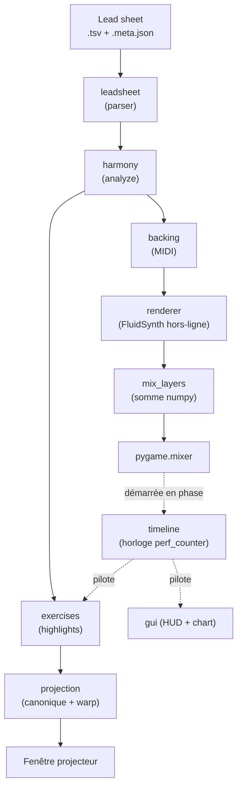

### 2.B — Dépendances entre modules  [corps]

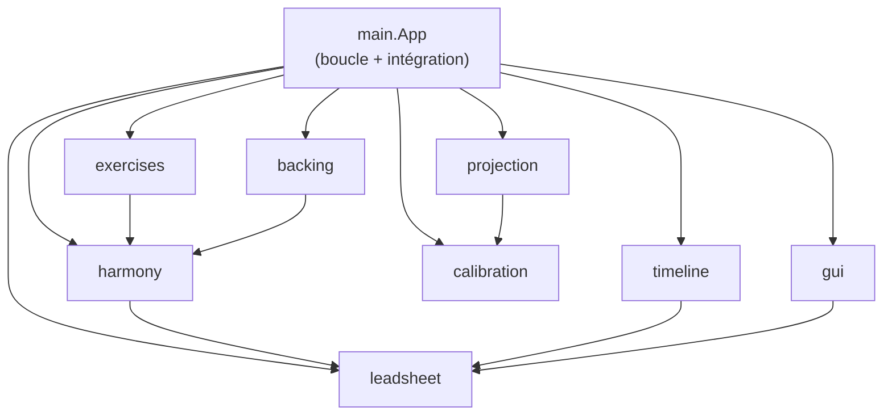

### 2.C — Phase de chargement et de rendu (séquence)  [corps]

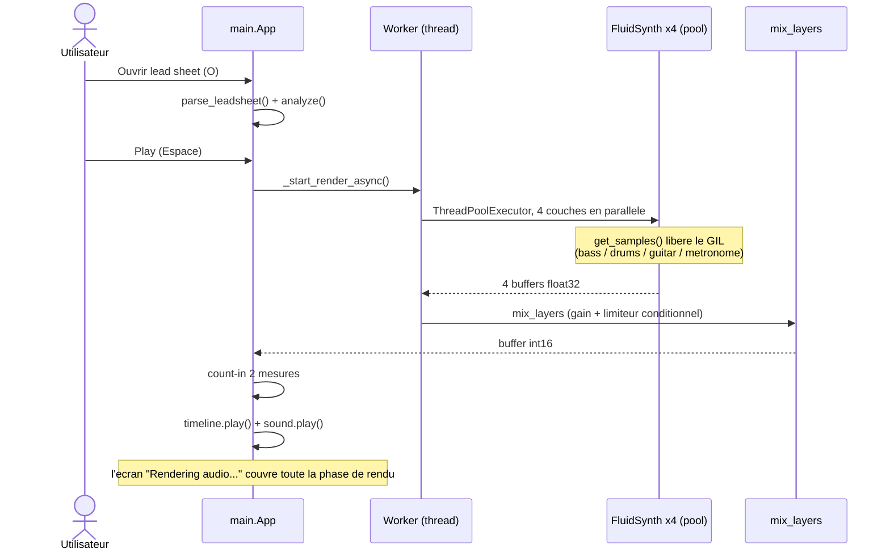

### 2.D — Boucle de jeu (60 FPS)  [corps]

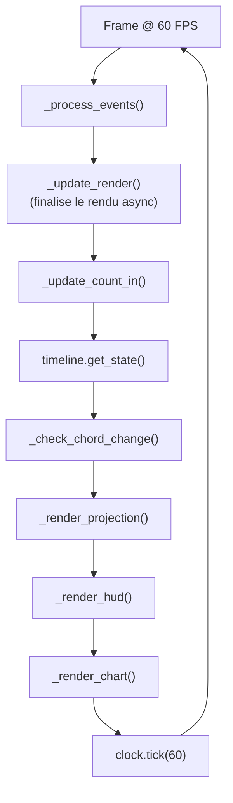

### 2.D bis — Pipeline d'overlays dans `_render_projection` (deux colonnes A4)  [corps]

> Ordre exact vérifié (`main.py:1686-1793`). Réécrit en **chaîne linéaire d'étapes optionnelles**
> (la condition devient l'étiquette de l'étape, plus de losanges imbriqués) pour tenir sur une
> A4 en deux colonnes. Les overlays chord-tone et root sont des sous-toggles **orthogonaux**
> (actifs sous n'importe quel exercice) ; Contour / Guide Tone / Flow / Start&End sont
> conditionnés par l'exercice sélectionné. Lecture : colonne de gauche de haut en bas, puis
> colonne de droite de haut en bas (inverser les flèches de la colonne 2 si l'on veut le
> serpentin bas-gauche → haut-droite).

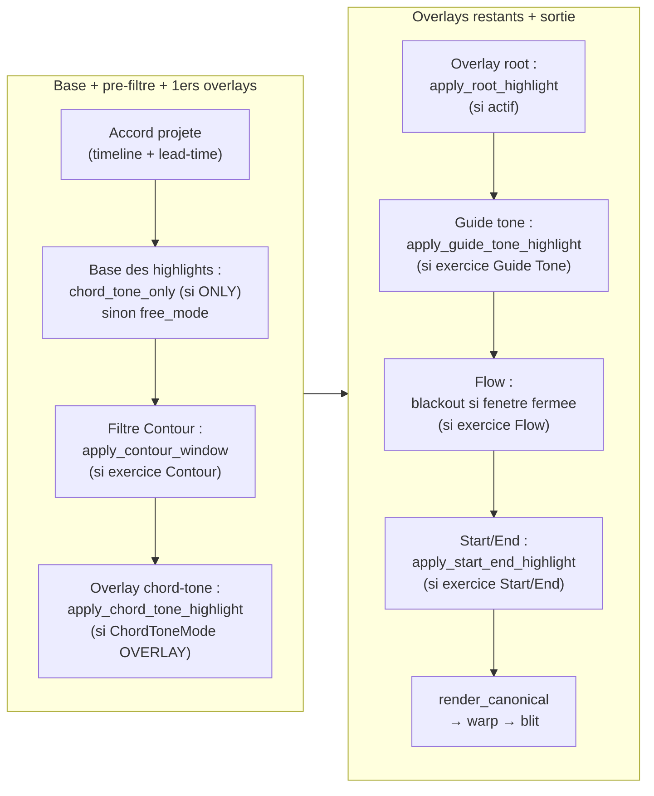

### 2.E — Machine à états de la calibration (5 phases)  [annexe — optionnel, la prose suffit]

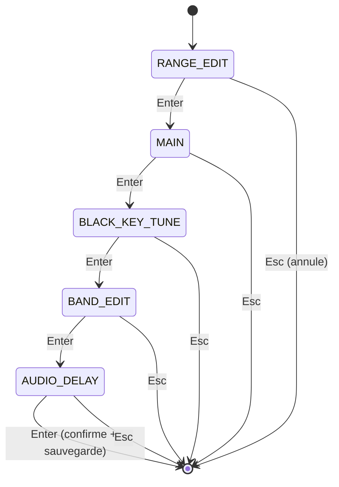

### 2.F — Résolution de gamme : le système de priorités (harmonie)  [corps]

> Vérifié `core.py:184-241` (cascade `resolve_scale`) + `:88-177` (pré-passe
> `_assign_chain_overrides`) + `:406-421` (ordre dans `analyze`). Lecture en **échelle de
> priorité** : une pré-passe sur la séquence tague d'abord les accords de chaînes (règles
> 3/4/7), puis chaque accord descend les tests **dans l'ordre, le premier vrai gagne** (sortie
> "oui" vers le résultat à droite, sinon on tombe au test suivant). Plus clair que deux losanges
> fourre-tout : l'ordre exact des règles devient lisible.

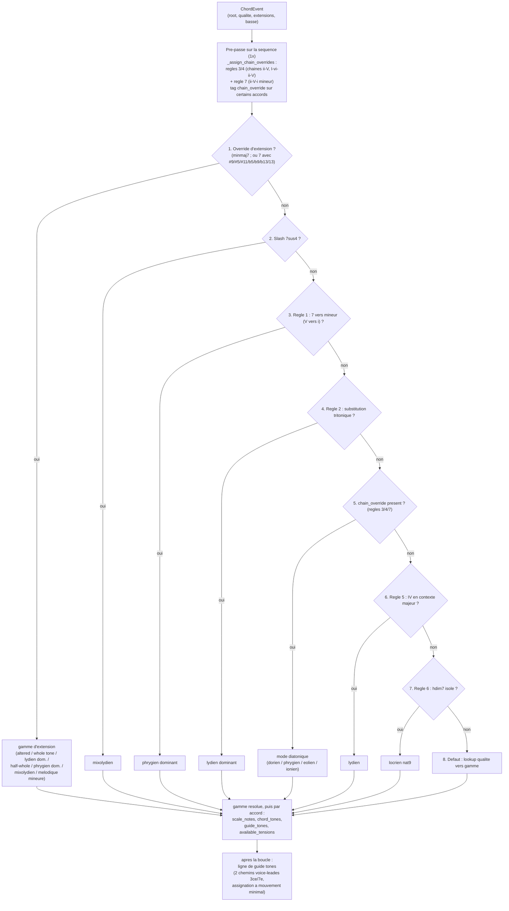

### 2.G — Génération du backing (une couche par instrument)  [corps]

> Modèle Huynh "un schéma par brique". Vue d'ensemble (corps) : les générateurs sont
> indépendants, chacun émet sa propre liste de `MidiEvent`, consommée par le renderer (cf. bloc
> rendu audio / séquence 2.C). Le détail algorithmique de chaque instrument est dans **2.H**
> (basse), **2.I** (comping) et **2.J** (batterie) ci-dessous, à garder en [annexe] (en
> remonter un seul en corps si l'on veut illustrer le propos).

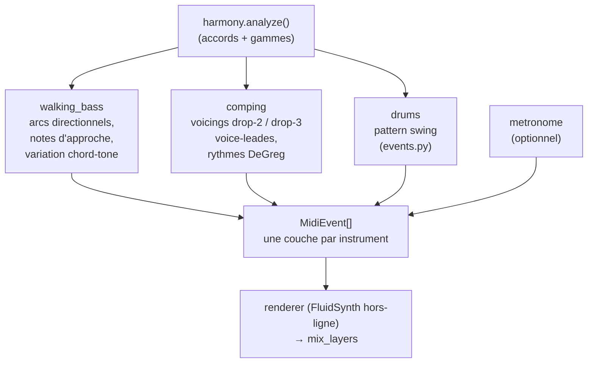

### 2.H — Walking bass : construction par mesure (basse)  [annexe]

> Vérifié `walking_bass.py:178-224` (`_walk_four`), `:278-296` (contrôleur de phrase),
> `:108-146` (notes d'approche). Registre E1-C3, une noire par temps.

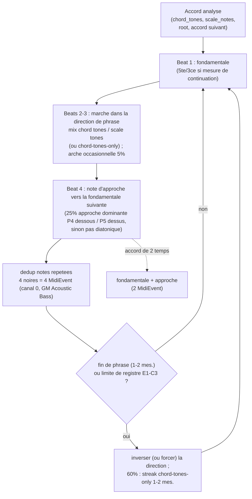

### 2.I — Comping : fenêtre 2 mesures + voicing (guitare)  [annexe]

> Vérifié `comping.py:141-205` (boucle fenêtre + hit), `comping_rhythms.py:161-169`
> (`pick_pattern`), `comping_voicings.py:99-151` (`candidate_voicings` / `best_voicing`).

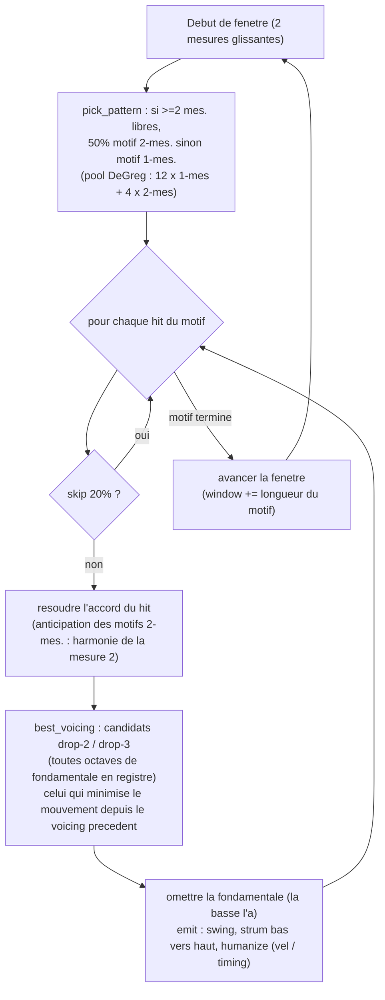

### 2.J — Batterie swing : motif par mesure (drums)  [annexe]

> Vérifié `events.py:102-164` (`generate_drums`). Canal 9 (GM drums), humanize sur tous les
> coups, `swing_ratio` 0.67 par défaut. Distinction clé : le **ride skip** ne tombe que sur le
> "and" de 2 et 4 ; le **ghost snare** n'est lié à aucun temps : il est tiré à **chaque** temps,
> sur le "and" swingué de ce temps (donc le and de 1, 2, 3 ou 4), à 25% indépendant.

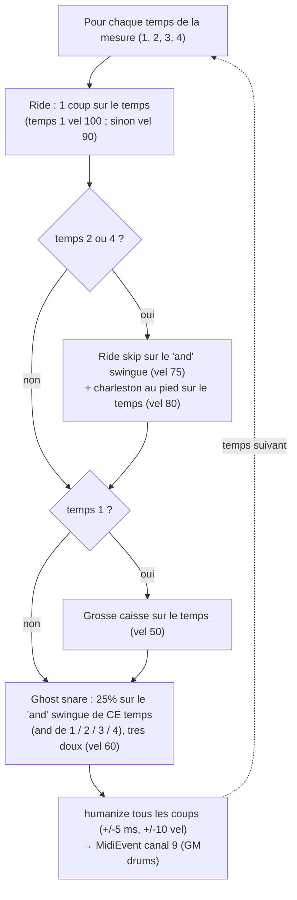

---

## 3. Faits techniques vérifiés (matière première des blocs §4.3)  [plan]

> Matière première, ne pas copier telle quelle dans le rapport : on en tire la prose
> [corps] et on renvoie les énumérations / chiffres exacts en [annexe].

### Les 8 modules

| Module | Rôle | Fichiers clés |
|---|---|---|
| `leadsheet` | Parser TSV + sidecar `.meta.json` → `LeadSheet` / `ChordEvent` | `parser.py`, `models.py` |
| `harmony` | Correspondance accord→gamme (table + mod-12), guide tones, `analyze()` | `core.py`, `constants.py` |
| `timeline` | Horloge musicale (perf_counter), résout l'accord courant, mode `wrap_around` | `engine.py` |
| `projection` | Layout 88 touches, rendu image canonique, warp homographie | `layout.py`, `renderer.py`, `warp.py` |
| `backing` | Walking bass + drums + comping + métronome → FluidSynth → numpy | `walking_bass.py`, `comping*.py`, `events.py`, `renderer.py` |
| `exercises` | 5 modes, highlights composables par overlays | `free.py`, `guide_tone.py`, `contour.py`, `flow.py`, `start_end.py`, `chord_tones.py`, `root.py` |
| `calibration` | UI à 5 phases → homographie, persistance JSON | `ui.py`, `models.py`, `persistence.py` |
| `gui` | HUD + grille style iReal Pro, mapping clavier | `hud.py`, `chart.py`, `input.py` |

### Analyse harmonique (`harmony/core.py`)
- Résolution par **priorités** : (1) overrides d'extension (`b9`/`#9`/`#11`/`#5`/`13`…,
  `minmaj7`) ; détection **slash-chord 7sus4** ; (2) **règles de contexte numérotées** :
  - Rule 1 : V7 → mineur ⇒ phrygien dominant
  - Rule 2 : substitution tritonique ⇒ lydien dominant
  - Rules 3 & 4 : chaînes ii-V et I-vi-ii-V (pré-passe, modes diatoniques)
  - Rule 5 : IV en contexte majeur ⇒ lydien
  - Rule 6 : hdim7 hors contexte ii°-V ⇒ locrien nat9
  - Rule 7 : i mineur de repos d'un ii-V-i mineur ⇒ éolien
  - (3) défaut par qualité.
- `_compute_guide_tone_line` : **deux** chemins voice-leadés (3ce / 7e) par assignation
  optimale minimisant le mouvement total. `core.py:275-381`.
- ✅ **Harmonisé** : CLAUDE.md / SPEC.md disaient "6 context rules" ; le code en a **7**
  numérotées (1 V7→min, 2 tritone, 3/4 chaînes ii-V, 5 IV→lydien, 6 hdim7, 7 i mineur de
  ii-V-i), dont 3, 4 et 7 dans une pré-passe (`_assign_chain_overrides`), en plus des
  overrides d'extension. Corrigé dans CLAUDE.md et SPEC.md (2026-06-22).

### Génération du backing (`backing/walking_bass.py`, `comping*.py`, `events.py`)
- **Walking bass** : arcs de direction de phrase, variation par chord-tone, notes d'approche
  chromatiques / diatoniques. `walking_bass.py`.
- **Comping** : voicings drop-2 / drop-3 avec optimisation de voice-leading, joués **rootless**
  (la fondamentale est gardée pour le voice-leading mais omise à l'émission, `COMP_OMIT_ROOT`,
  pour laisser le grave à la basse) ; 12 patterns rythmiques swing 1-mesure + 4 sur 2 mesures
  (Phil DeGreg) avec anticipations. `comping.py`, `comping_voicings.py`, `comping_rhythms.py`.
- **Batterie + métronome + count-in** : générateurs de patterns swing et de clic. `events.py`.
- Chaque générateur émet une **liste de `MidiEvent`** indépendante ⇒ une couche par instrument,
  consommée par le renderer. Schéma : §2.G.

### Rendu audio en couches parallèles (`backing/renderer.py`, `main.py`)
- **4 couches** rendues en parallèle dans un `ThreadPoolExecutor(max_workers=4)` lancé
  depuis un thread worker ; la boucle principale reste réactive et sonde via
  `_update_render`. `main.py:1187-1215`.
- Une **instance FluidSynth indépendante par couche** (pas d'état mutable partagé) ;
  `get_samples()` libère le GIL ⇒ recouvrement réel sur plusieurs cœurs. `renderer.py:19-70`.
- Instruments : **basse = GM Acoustic Bass** (program 33), **guitare = GM Electric Guitar
  Jazz** (program 26), **batterie = canal 9**. Balance par CC7 : basse 60, guitare 85,
  batterie 115. `renderer.py:34-43`.
- **`mix_layers`** : somme int16 + **gain de mastering fixe 2.5×** + **limiteur
  conditionnel** (n'atténue que si le pic dépasse 0.95 pleine échelle) ⇒ la dynamique et la
  balance restent linéaires d'un mix à l'autre. `renderer.py:79-105`.
  - ⚠️ **Correction vs CLAUDE.md** : "clips + converts to int16" est trop simple ; c'est un
    limiteur conditionnel, pas un clip systématique (choix délibéré contre le pompage).
- **Cache par couche** (`self._layers`, buffers int16) : basculer le métronome ou la densité
  du backing ⇒ simple somme numpy, jamais de re-rendu FluidSynth. Le remix se **raccorde
  depuis la position de lecture** (`_remix_and_swap`, `main.py:1289-1326`).

### Projection (`projection/`, `main.py`)
- Image **canonique 1920×200** (`render_canonical`) → `warp_canonical_to_projector`
  (`cv2.warpPerspective`) → blit dans la fenêtre projecteur. `main.py:1794-1800`.
- **Projection lead** : `_PROJECTION_LEAD_SECONDS (0.16) - audio_delay_ms/1000`, converti en
  beats, ajouté au beat courant avant de résoudre l'accord projeté ⇒ masque la latence du
  projecteur. `main.py:136`, `:1661-1664`. Plus une **anticipation musicale** optionnelle
  (8e ou noire) constante quel que soit le tempo. `main.py:1666-1675`.

### Timeline et mode boucle (`timeline/engine.py`, `main.py`)
- Horloge **wall-clock** (perf_counter) ; `get_state()` appelé une fois par frame, lu par la
  projection ET le HUD. Recherche dichotomique de l'accord. `engine.py:140-197`.
- **`wrap_around=True`** : au-delà de la dernière reprise, le beat est pris modulo la
  longueur totale au lieu d'être borné. `engine.py:87-98`, `:169-173`.
- **Mode boucle** : les barres sélectionnées deviennent une **mini lead sheet temporaire**
  (re-basée à 0) répétée pour couvrir ~4 min, ré-analysée, avec une timeline `wrap_around` et
  un **backing re-rendu** (basse/comping varient à chaque passage) ; les patterns d'exercices
  sont régénérés sur cette forme ⇒ les modes de jeu traitent la boucle comme une nouvelle
  forme continue. La grille, elle, continue d'afficher le morceau d'origine. `main.py:976-1033`.

### Multi-fenêtre et DPI (`main.py`)
- **3 fenêtres** : HUD (écran 0), grille (écran 1 si ≥3 écrans, sinon 0), projecteur
  (dernier écran), via l'astuce `WINDOWPOS_CENTERED | index`. Surchargeable par
  `HUD_DISPLAY` / `CHART_DISPLAY` / `PROJ_DISPLAY`. `main.py:326-392`.
- **Conscience DPI** (Windows) au démarrage pour que la fenêtre projecteur s'ouvre à la
  résolution physique réelle et que la calibration sauvegardée reste valide. `main.py:23-32`.

### Boucle principale mono-thread
- Boucle 60 FPS unique (`run`, `main.py:509-521`). **Seul** le rendu audio utilise des
  threads (worker + `ThreadPoolExecutor`). Pas de scheduling temps réel grâce à l'audio
  pré-rendu.

### Interface (`gui/`)
- **HUD** (`hud.py`) : info morceau, accord courant / suivant, sélecteur d'exercice, barre de
  progression, raccourcis, indicateur de mode frozen, grille de count-in.
- **Grille style iReal Pro** (`chart.py`, `render_chart`) : 4 mesures par ligne, auto-échelle
  pour qu'une forme de 32+ mesures tienne à l'écran, cellule active surlignée, bande de boucle
  (amber en édition / bleu confirmée).
- **Mapping clavier** (`input.py`) : mapping touche → action par enum.
- Pas de schéma algorithmique : à montrer par **captures d'écran** (HUD + grille).

---

## 4. Corrections relevées pendant la vérification (propagées dans CLAUDE.md + SPEC.md le 2026-06-22)

1. **Harmonie : 7 règles de contexte**, pas 6 (cf. §3). Préférer "système de priorités".
2. **`mix_layers` = gain + limiteur conditionnel**, pas un clip systématique (cf. §3).
3. **Overlays chord-tone / root = sous-toggles orthogonaux** appliqués sous n'importe quel
   exercice ; seuls Contour (idx 2) / Guide Tone (1) / Flow (3) / Start&End (4) sont
   conditionnés par l'exercice. Ordre exact en §2.D bis.
4. **Patch guitare = Electric Guitar (jazz) GM #27** (program 26), pas "nylon/electric"
   générique ; chiffres de balance CC7 citables (60 / 85 / 115) et gain de mastering 2.5×.
5. **Timeline = horloge wall-clock (perf_counter)**, démarrée en phase avec l'audio ; pas
   "dérivée de la position de lecture audio".

---

## 5. Table de traçabilité (claim → source)  [plan]

> Pour ta confiance pendant la rédaction et pour répondre au jury. **Jamais dans le rapport.**

| Affirmation | Source |
|---|---|
| Boucle 60 FPS, ordre des étapes | `main.py:509-521` |
| Rendu 4 couches en parallèle (pool) | `main.py:1187-1215` |
| Une instance FluidSynth par couche, GIL libéré | `renderer.py:19-70` |
| `mix_layers` gain + limiteur conditionnel | `renderer.py:79-105` |
| Cache de couches + raccord mi-flux | `main.py:1289-1326` |
| Projection lead (constante + calcul) | `main.py:136`, `:1661-1675` |
| Pipeline d'overlays (ordre exact) | `main.py:1686-1793` |
| Phases de calibration (enum) | `calibration/ui.py:59-64` |
| Timeline `wrap_around` | `engine.py:87-98`, `:169-173` |
| Forme temporaire du mode boucle | `main.py:976-1033` |
| Règles de résolution de gamme | `core.py:184-241`, `:88-177` |
| Ligne de guide tones voice-leadée | `core.py:275-381` |
| Multi-fenêtre / placement par écran | `main.py:326-392` |
| Conscience DPI Windows | `main.py:23-32` |
| Walking bass (arcs, approche, variation) | `backing/walking_bass.py` |
| Comping rootless drop-2/3 + rythmes DeGreg | `backing/comping.py`, `comping_voicings.py`, `comping_rhythms.py` |
| Patterns batterie / métronome / count-in | `backing/events.py` |
| Interface (HUD / grille iReal / mapping) | `gui/hud.py`, `chart.py`, `input.py` |
| Stack des dépendances | `pyproject.toml:9-15`, `:24-26` |

---

## 6. Diagrammes à produire (par ordre de priorité)

**Ossature (indispensable) :**
1. **2.A pipeline** + **2.B modules** (l'architecture, §4.1).
2. **2.C séquence de chargement** (le point fort : rendu parallèle non bloquant ; le
   "diagramme de phase" demandé par Patrick).

**Un schéma par brique (modèle Huynh) :**
3. **2.F** résolution de gamme (harmonie), **2.G** vue d'ensemble du backing.
4. **2.D bis** pipeline d'overlays (version deux colonnes A4), **2.D** boucle de jeu.
5. **Détail backing par instrument** (annexe) : **2.H** walking bass, **2.I** comping,
   **2.J** batterie swing.

**Figures non-Mermaid :**
6. **Photo** projection : bande canonique vs. rendu projeté sur les touches (proto-media).
7. **Captures d'écran** : HUD + grille style iReal Pro.

**Hors corps :** **2.E** (machine à états de la calibration) reste en annexe ou en prose,
l'assistant étant linéaire (RANGE → MAIN → BLACK_KEY → BAND → AUDIO_DELAY). Premiers leviers
de coupe si le chapitre déborde : redescendre **2.D** puis **2.D bis** en annexe (cf. légende).
