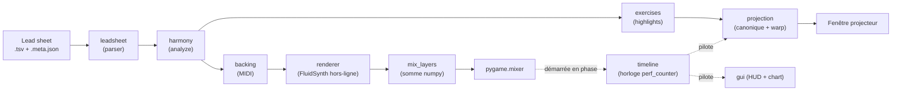
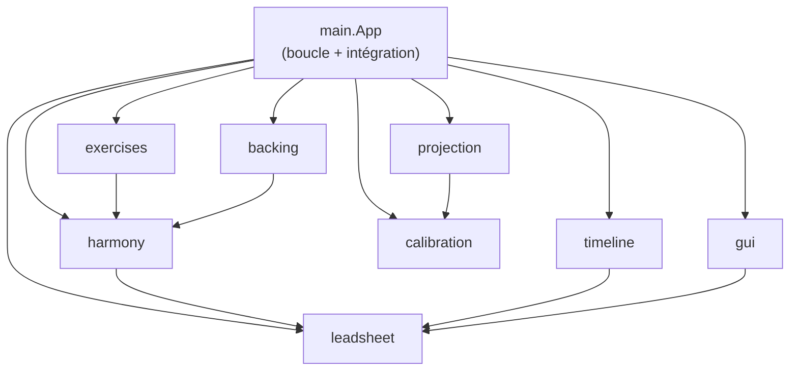
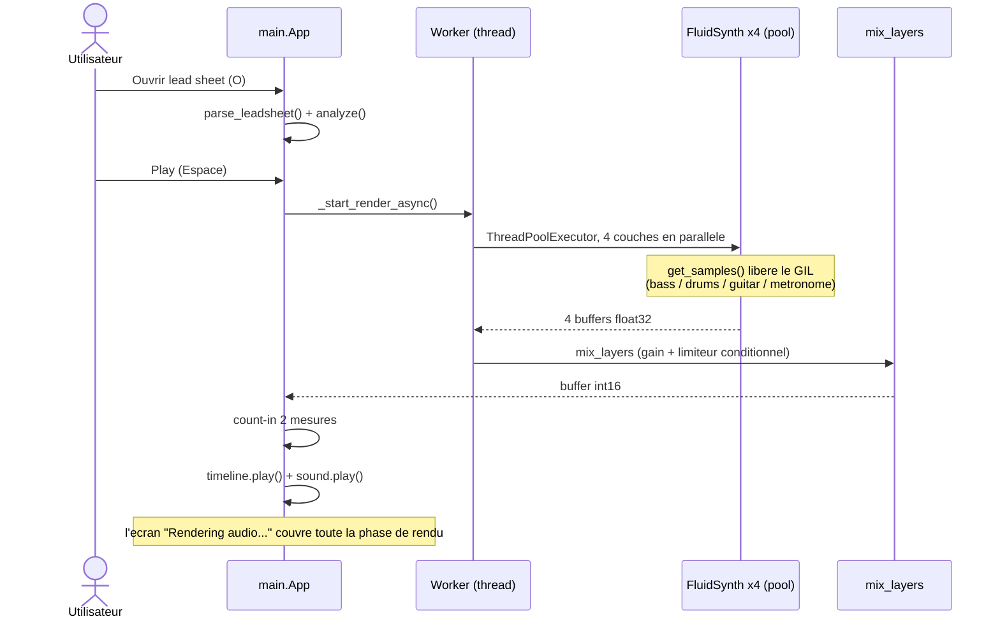
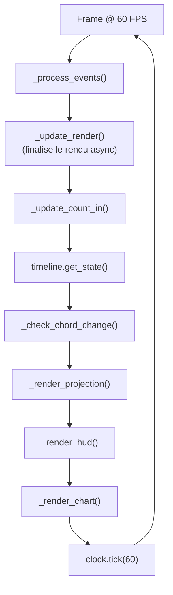
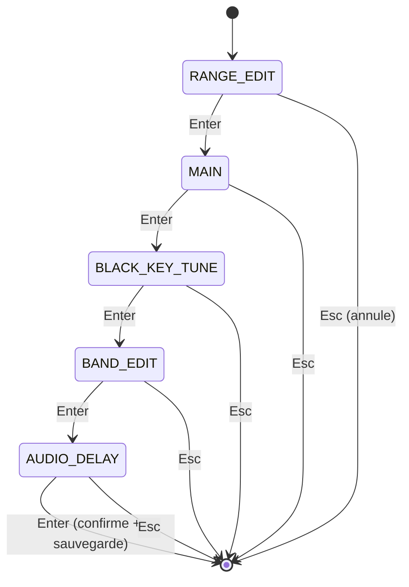

# Plan détaillé — Chapitre "Solution technique"

> But de ce document : un plan **vérifié contre le code** (pas seulement contre CLAUDE.md)
> pour rédiger le chapitre 4 "Solution technique". Complète le squelette §5 de
> `plan-redaction.md` en y ajoutant : le gabarit des thèses de référence, une structure
> adaptée à l'architecture réelle (un pipeline, pas un client/serveur), les diagrammes
> prêts à dessiner (Mermaid), et une table de traçabilité claim → `fichier:ligne`.
>
> Vérifié le 2026-06-22 contre `src/leadsheet_utility/` (commit `d2f6aa3`).
> Style : "nous", pas de tirets cadratins, guillemets droits.

---

## Légende d'arbitrage (où va chaque morceau)

Cible du chapitre : **~10 pages** (budget `plan-redaction.md` : 8-12). Pour tenir cette
cible sans tout perdre, chaque morceau est étiqueté :

- **[corps]** : va dans le chapitre rédigé.
- **[annexe]** : énumérations complètes, arborescence, captures, renvoyées en annexe.
- **[plan]** : reste dans ce document de travail (ou dans le code), jamais dans le rapport.

Règle générale : le corps explique le **principe** et les **3-4 décisions techniques
intéressantes** ; les constantes exactes, listes exhaustives et numéros de ligne descendent
en annexe ou restent ici. Estimation : la version [corps] tient en **~8-9 pages**, ce qui
laisse de la marge. Tout transcrire (les 6 sous-systèmes en détail + les 5 diagrammes)
dépasserait 11-13 pages denses.

---

## 0. Ce que font les thèses de référence (le gabarit)

| Thèse | Titre du chapitre technique | Structure | À emprunter |
|---|---|---|---|
| **Carusi** (même superviseur) | "Implémentation" (p.23-38) | Architecture du système (schéma haut niveau + diagramme de déploiement UML + arborescence) → Backend → Frontend (cas d'usage + interface + captures) | Le **schéma d'architecture haut niveau** (sa Fig.8 avec frontière client/serveur), l'**arborescence ASCII**, le parcours **brique par brique** |
| **Courtin** (même superviseur) | "Solution développée" (p.16-24) | Outils utilisés → Structure du projet → Traitement → Entraînement → Choix → Application | Le **squelette en pipeline** : outils, puis structure, puis on suit le flux étape par étape. C'est le plus proche de notre projet |
| **Huynh** (même domaine, musique) | "Proposition" (format IEEE) | Décompose le logiciel en modules, **un diagramme d'algorithme par module** (le graphe de progressions d'accords) | Le modèle "**un schéma par brique algorithmique**" pour la walking bass / le comping |

**Constat important :** aucune des trois n'a de vrai diagramme de séquence/phase. Le
"diagramme de phase haut niveau" demandé par Patrick est donc une **valeur ajoutée**, pas
un attendu. L'analogue UML le plus proche chez Carusi est le diagramme de déploiement +
cas d'usage. Nous avons les mains libres pour proposer des diagrammes de séquence/d'état.

**Notre projet n'est pas client/serveur.** C'est un **pipeline mono-processus**. Calquer
le plan de Carusi tel quel serait une erreur : on adapte au flux
`parser → harmonie → exercices → projection` (+ branche `backing → rendu → mix → lecture`).

---

## 1. Structure proposée du chapitre

Fusion du détail de Carusi et du squelette pipeline de Courtin. Pour chaque section :
le contenu, la figure, les fichiers source, la thèse de référence.

### 4.1 Vue d'ensemble : une architecture en pipeline  [corps]
- **Contenu :** poser le principe avant les pièces (consigne récurrente de Patrick).
  Une grille est lue, l'harmonie analysée, l'info utile projetée en temps réel sur les
  touches, synchronisée à un backing track généré. Un seul processus, une seule horloge.
- **Figure :** *Diagramme de flux haut niveau* (cf. §2.A).
- **Source :** `src/leadsheet_utility/` (les 8 modules), `main.py:509-521` (la boucle).
- **Référence :** Carusi Fig.8 (architecture du système).

### 4.2 Architecture du code  [corps]
- **Contenu :** les 8 modules et leurs dépendances ; pourquoi un pipeline (chaque étape
  pure et testable, l'audio pré-rendu élimine l'ordonnancement temps réel).
- **Figures :** *Diagramme de modules* (cf. §2.B) **[corps]** + tableau des 8 modules
  **[corps]**. L'**arborescence ASCII complète** de `src/leadsheet_utility/` part en
  **[annexe]** (Carusi la met dans le corps, mais c'est du remplissage optionnel).
- **Source :** voir le tableau des modules en §3.
- **Référence :** Carusi (arborescence p.25), Courtin (4.2 structure du projet).

### 4.3 Outils et choix techniques (besoin → choix → justification)  [corps]
- **Contenu :** un **tableau besoin → choix → pourquoi** (Patrick refuse le tableau
  "le LLM recommande X" : on documente ce qu'on a CHOISI et POURQUOI). Stack réel :

  | Besoin | Choix | Justification |
  |---|---|---|
  | Multi-fenêtre dans un seul processus (projecteur plein écran + HUD + grille) | **pygame-ce** | `pygame.Window` permet plusieurs fenêtres natives ; pygame standard non |
  | Synthèse audio hors-ligne d'événements MIDI | **FluidSynth** (`pyfluidsynth`) + SoundFont GM | rendu sans driver audio, `get_samples()` libère le GIL (rendu parallèle) |
  | Correction de la perspective du projecteur | **OpenCV** (`cv2.warpPerspective`) | homographie planaire = une seule transformation, calibration robuste |
  | Sommation/mix des couches, géométrie | **numpy** | somme int16 en microsecondes, bascule de couche instantanée |
  | Analyse harmonique | **maison** (dictionnaire + arithmétique mod-12) | décision KISS : pas de dépendance lourde (music21) pour une table de correspondance |
  | Gestion d'environnement | **Poetry** (`package-mode = false`) | reproductible, groupe `stats` séparé (scipy + matplotlib) |

- **Source :** `pyproject.toml:10-15` (deps), `:24-26` (groupe stats), `:9` (Python 3.13+).
- **Référence :** Courtin 4.1 (outils utilisés), annotation Patrick p.13.

### 4.4 Diagrammes de phase / séquence haut niveau (demande explicite de Patrick)  [corps]
- **Contenu :** garder **deux** diagrammes dans le corps : **2.C** (séquence de rendu,
  le point technique fort : rendu parallèle non bloquant) **[corps]** et **2.E** (machine
  à états de calibration, littéralement un "diagramme de phases", trivial à produire)
  **[corps]**. La **boucle de jeu 2.D** et le **pipeline d'overlays 2.D bis** sont
  intéressants mais coûteux en place : au plus un des deux en corps, l'autre en
  **[annexe]** ou résumé en deux phrases.
- **Référence :** style Carusi (déploiement / cas d'usage), mais en séquence/état.

### 4.5 Les briques techniques  [corps]
Quatre blocs **[corps]** (les plus distinctifs), deux pliés en bref. Détail vérifié et
chiffres citables en §3.

**Les 4 blocs développés [corps] :**
1. **Analyse harmonique** : table qualité→gamme, mod-12, lignes de guide tones voice-leadées,
   le système de priorités (overrides d'extension → règles de contexte → défaut). Dire
   "système de priorités" en une à deux phrases ; la **liste des 7 règles → [annexe]**.
3. **Rendu audio en couches parallèles + cache + mix** : l'argument "bascule instantanée"
   (le point technique le plus fort). Les **chiffres exacts** (CC7 60/85/115, gain 2.5×,
   numéros de programme GM) → **[annexe]** ou note de bas de page, pas dans la prose.
4. **Projection** : image canonique 1920×200 → homographie → projecteur ; le *projection lead*.
5. **Pipeline d'overlays des exercices** : base → filtre Contour → chord-tone / root /
   guide tone / Flow / Start&End. Décrit en prose ; le **flowchart complet 2.D bis → [annexe]**.

**Les 2 blocs pliés en bref [corps bref] :**
2. **Génération du backing** : une phrase (walking bass à arcs directionnels, batterie swing,
   comping drop-2/drop-3 voice-leadé). Schéma façon Huynh **[annexe]** si la place manque.
6. **Timeline et mode boucle** : deux phrases (horloge perf_counter, `wrap_around`, forme
   temporaire).

### 4.6 Calibration et multi-écran  [corps]
- **Contenu :** la machine à 5 phases (diagramme 2.E), `getPerspectiveTransform`, la
  conscience DPI (Windows), le placement d'une fenêtre par écran. **À garder court**
  (0.5-1 p).
- **Source :** `calibration/ui.py:59-64`, `main.py:23-32` (DPI), `main.py:326-392` (écrans).

---

## 2. Les diagrammes (Mermaid, prêts à convertir)

> Mermaid se rend nativement dans beaucoup d'outils ; sinon export PNG/SVG via
> mermaid.live ou l'extension VS Code. Tous vérifiés contre le code.

### 2.A — Pipeline / flux de données (haut niveau)  [corps]



### 2.B — Dépendances entre modules  [corps]



### 2.C — Phase de chargement et de rendu (séquence)  [corps]



### 2.D — Boucle de jeu (60 FPS)  [annexe / au choix]



### 2.D bis — Pipeline d'overlays dans `_render_projection`  [annexe]

> Ordre exact vérifié (`main.py:1686-1793`). Les overlays chord-tone et root sont des
> sous-toggles orthogonaux (actifs sous n'importe quel exercice) ; Contour / Guide Tone /
> Flow / Start&End sont conditionnés par l'exercice sélectionné.

```mermaid
flowchart TD
    A["Accord projete<br/>(timeline + lead-time)"] --> B{ChordToneMode<br/>= ONLY ?}
    B -- oui --> C["chord_tone_only_highlights"]
    B -- non --> D["free_mode_highlights"]
    C --> E{Exercice = Contour ?}
    D --> E
    E -- oui --> F["apply_contour_window<br/>(pre-filtre)"]
    E -- non --> G
    F --> G{ChordToneMode<br/>= OVERLAY ?}
    G -- oui --> H["apply_chord_tone_highlight"]
    G -- non --> I
    H --> I{Root active ?}
    I -- oui --> J["apply_root_highlight"]
    I -- non --> K
    J --> K{Exercice = Guide Tone ?}
    K -- oui --> L["apply_guide_tone_highlight<br/>(next preview puis courant)"]
    K -- non --> M
    L --> M{Exercice = Flow ?<br/>(fenetre fermee)}
    M -- oui --> N["highlights = [] (blackout)"]
    M -- non --> O
    N --> P
    O --> P{Exercice = Start/End ?}
    P -- oui --> Q["apply_start_end_highlight"]
    P -- non --> R
    Q --> R["render_canonical → warp → blit"]
```

### 2.E — Machine à états de la calibration (5 phases)  [corps]



---

## 3. Faits techniques vérifiés (matière première des blocs §4.5)  [plan]

> Matière première, ne pas copier telle quelle dans le rapport : on en tire la prose
> [corps] et on renvoie les énumérations / chiffres exacts en [annexe].

### Les 8 modules

| Module | Rôle | Fichiers clés |
|---|---|---|
| `leadsheet` | Parser TSV + sidecar `.meta.json` → `LeadSheet` / `ChordEvent` | `parser.py`, `models.py` |
| `harmony` | Correspondance accord→gamme (table + mod-12), guide tones, `analyze()` | `core.py`, `constants.py` |
| `timeline` | Horloge musicale (perf_counter), résout l'accord courant, mode `wrap_around` | `engine.py` |
| `projection` | Layout 88 touches, rendu image canonique, warp homographie | `layout.py`, `renderer.py`, `warp.py` |
| `backing` | Walking bass + drums + comping + métronome → FluidSynth → numpy | `walking_bass.py`, `comping*.py`, `events.py`, `renderer.py` |
| `exercises` | 5 modes, highlights composables par overlays | `free.py`, `guide_tone.py`, `contour.py`, `flow.py`, `start_end.py`, `chord_tones.py`, `root.py` |
| `calibration` | UI à 5 phases → homographie, persistance JSON | `ui.py`, `models.py`, `persistence.py` |
| `gui` | HUD + grille style iReal Pro, mapping clavier | `hud.py`, `chart.py`, `input.py` |

### Analyse harmonique (`harmony/core.py`)
- Résolution par **priorités** : (1) overrides d'extension (`b9`/`#9`/`#11`/`#5`/`13`…,
  `minmaj7`) ; détection **slash-chord 7sus4** ; (2) **règles de contexte numérotées** :
  - Rule 1 : V7 → mineur ⇒ phrygien dominant
  - Rule 2 : substitution tritonique ⇒ lydien dominant
  - Rules 3 & 4 : chaînes ii-V et I-vi-ii-V (pré-passe, modes diatoniques)
  - Rule 5 : IV en contexte majeur ⇒ lydien
  - Rule 6 : hdim7 hors contexte ii°-V ⇒ locrien nat9
  - Rule 7 : i mineur de repos d'un ii-V-i mineur ⇒ éolien
  - (3) défaut par qualité.
- `_compute_guide_tone_line` : **deux** chemins voice-leadés (3ce / 7e) par assignation
  optimale minimisant le mouvement total. `core.py:275-381`.
- ✅ **Harmonisé** : CLAUDE.md / SPEC.md disaient "6 context rules" ; le code en a **7**
  numérotées (1 V7→min, 2 tritone, 3/4 chaînes ii-V, 5 IV→lydien, 6 hdim7, 7 i mineur de
  ii-V-i), dont 3, 4 et 7 dans une pré-passe (`_assign_chain_overrides`), en plus des
  overrides d'extension. Corrigé dans CLAUDE.md et SPEC.md (2026-06-22).

### Rendu audio en couches parallèles (`backing/renderer.py`, `main.py`)
- **4 couches** rendues en parallèle dans un `ThreadPoolExecutor(max_workers=4)` lancé
  depuis un thread worker ; la boucle principale reste réactive et sonde via
  `_update_render`. `main.py:1187-1215`.
- Une **instance FluidSynth indépendante par couche** (pas d'état mutable partagé) ;
  `get_samples()` libère le GIL ⇒ recouvrement réel sur plusieurs cœurs. `renderer.py:19-70`.
- Instruments : **basse = GM Acoustic Bass** (program 33), **guitare = GM Electric Guitar
  Jazz** (program 26), **batterie = canal 9**. Balance par CC7 : basse 60, guitare 85,
  batterie 115. `renderer.py:34-43`.
- **`mix_layers`** : somme int16 + **gain de mastering fixe 2.5×** + **limiteur
  conditionnel** (n'atténue que si le pic dépasse 0.95 pleine échelle) ⇒ la dynamique et la
  balance restent linéaires d'un mix à l'autre. `renderer.py:79-105`.
  - ⚠️ **Correction vs CLAUDE.md** : "clips + converts to int16" est trop simple ; c'est un
    limiteur conditionnel, pas un clip systématique (choix délibéré contre le pompage).
- **Cache par couche** (`self._layers`, buffers int16) : basculer le métronome ou la densité
  du backing ⇒ simple somme numpy, jamais de re-rendu FluidSynth. Le remix se **raccorde
  depuis la position de lecture** (`_remix_and_swap`, `main.py:1289-1326`).

### Projection (`projection/`, `main.py`)
- Image **canonique 1920×200** (`render_canonical`) → `warp_canonical_to_projector`
  (`cv2.warpPerspective`) → blit dans la fenêtre projecteur. `main.py:1794-1800`.
- **Projection lead** : `_PROJECTION_LEAD_SECONDS (0.16) - audio_delay_ms/1000`, converti en
  beats, ajouté au beat courant avant de résoudre l'accord projeté ⇒ masque la latence du
  projecteur. `main.py:136`, `:1661-1664`. Plus une **anticipation musicale** optionnelle
  (8e ou noire) constante quel que soit le tempo. `main.py:1666-1675`.

### Timeline et mode boucle (`timeline/engine.py`, `main.py`)
- Horloge **wall-clock** (perf_counter) ; `get_state()` appelé une fois par frame, lu par la
  projection ET le HUD. Recherche dichotomique de l'accord. `engine.py:140-197`.
- **`wrap_around=True`** : au-delà de la dernière reprise, le beat est pris modulo la
  longueur totale au lieu d'être borné. `engine.py:87-98`, `:169-173`.
- **Mode boucle** : les barres sélectionnées deviennent une **mini lead sheet temporaire**
  (re-basée à 0) répétée pour couvrir ~4 min, ré-analysée, avec une timeline `wrap_around` et
  un **backing re-rendu** (basse/comping varient à chaque passage) ; les patterns d'exercices
  sont régénérés sur cette forme ⇒ les modes de jeu traitent la boucle comme une nouvelle
  forme continue. La grille, elle, continue d'afficher le morceau d'origine. `main.py:976-1033`.

### Multi-fenêtre et DPI (`main.py`)
- **3 fenêtres** : HUD (écran 0), grille (écran 1 si ≥3 écrans, sinon 0), projecteur
  (dernier écran), via l'astuce `WINDOWPOS_CENTERED | index`. Surchargeable par
  `HUD_DISPLAY` / `CHART_DISPLAY` / `PROJ_DISPLAY`. `main.py:326-392`.
- **Conscience DPI** (Windows) au démarrage pour que la fenêtre projecteur s'ouvre à la
  résolution physique réelle et que la calibration sauvegardée reste valide. `main.py:23-32`.

### Boucle principale mono-thread
- Boucle 60 FPS unique (`run`, `main.py:509-521`). **Seul** le rendu audio utilise des
  threads (worker + `ThreadPoolExecutor`). Pas de scheduling temps réel grâce à l'audio
  pré-rendu.

---

## 4. Corrections relevées pendant la vérification (propagées dans CLAUDE.md + SPEC.md le 2026-06-22)

1. **Harmonie : 7 règles de contexte**, pas 6 (cf. §3). Préférer "système de priorités".
2. **`mix_layers` = gain + limiteur conditionnel**, pas un clip systématique (cf. §3).
3. **Overlays chord-tone / root = sous-toggles orthogonaux** appliqués sous n'importe quel
   exercice ; seuls Contour (idx 2) / Guide Tone (1) / Flow (3) / Start&End (4) sont
   conditionnés par l'exercice. Ordre exact en §2.D bis.
4. **Patch guitare = Electric Guitar (jazz) GM #27** (program 26), pas "nylon/electric"
   générique ; chiffres de balance CC7 citables (60 / 85 / 115) et gain de mastering 2.5×.
5. **Timeline = horloge wall-clock (perf_counter)**, démarrée en phase avec l'audio ; pas
   "dérivée de la position de lecture audio".

---

## 5. Table de traçabilité (claim → source)  [plan]

> Pour ta confiance pendant la rédaction et pour répondre au jury. **Jamais dans le rapport.**

| Affirmation | Source |
|---|---|
| Boucle 60 FPS, ordre des étapes | `main.py:509-521` |
| Rendu 4 couches en parallèle (pool) | `main.py:1187-1215` |
| Une instance FluidSynth par couche, GIL libéré | `renderer.py:19-70` |
| `mix_layers` gain + limiteur conditionnel | `renderer.py:79-105` |
| Cache de couches + raccord mi-flux | `main.py:1289-1326` |
| Projection lead (constante + calcul) | `main.py:136`, `:1661-1675` |
| Pipeline d'overlays (ordre exact) | `main.py:1686-1793` |
| Phases de calibration (enum) | `calibration/ui.py:59-64` |
| Timeline `wrap_around` | `engine.py:87-98`, `:169-173` |
| Forme temporaire du mode boucle | `main.py:976-1033` |
| Règles de résolution de gamme | `core.py:184-241`, `:88-177` |
| Ligne de guide tones voice-leadée | `core.py:275-381` |
| Multi-fenêtre / placement par écran | `main.py:326-392` |
| Conscience DPI Windows | `main.py:23-32` |
| Stack des dépendances | `pyproject.toml:9-15`, `:24-26` |

---

## 6. Diagrammes à produire en priorité (rappel)

1. **2.A pipeline** + **2.B modules** (l'ossature du chapitre).
2. **2.C séquence de rendu** (le point technique fort : rendu parallèle non bloquant).
3. **2.E machine à états de calibration** (trivial, et c'est littéralement un "diagramme de
   phases").
4. **2.D / 2.D bis** si la place le permet (boucle + pipeline d'overlays).
