<!-- _paginate: false -->
<!-- _footer: '' -->
<!-- _class: lead -->

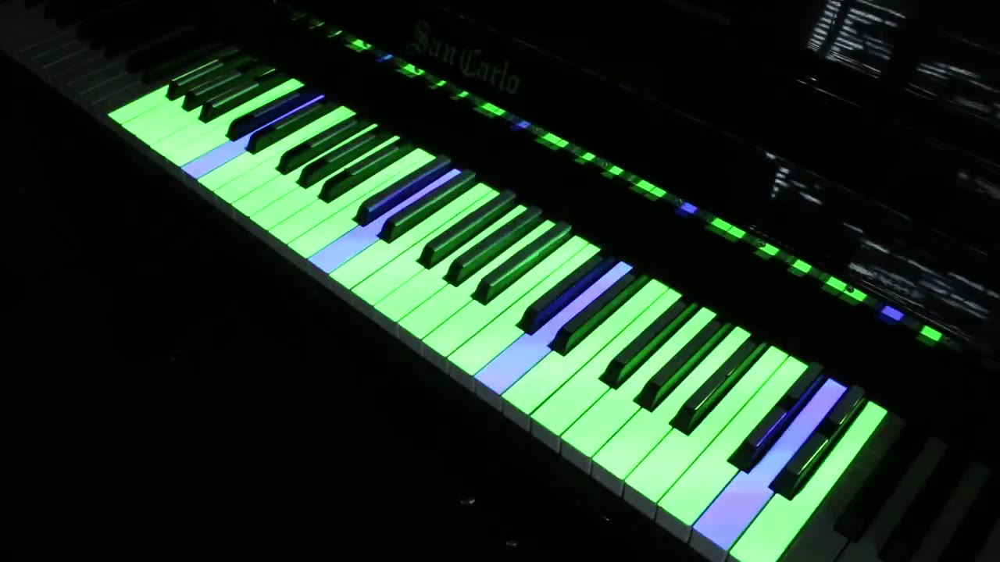

# Leadsheet-Utility

Un artefact pour réduire la charge cognitive de l'improvisation au piano jazz par la réalité augmentée et diminuée

Alexandre Riedo 
Projet de bachelor en systèmes d'information et science des services 
Centre Universitaire d'Informatique, Université de Genève 
Supervisé par le Professeur Patrick Roth 26 juin 2026

<!--
NOTE (script ~30s) : Bonjour, je m'appelle Alexandre Riedo. Je vous présente Leadsheet-Utility,
un artefact qui éclaire les touches d'un piano pour soutenir l'improvisation jazz. La photo, c'est
le système en action : pièce sombre, et seules les touches utiles sont allumées, codées par couleur.
Plan : le problème, ma question de recherche, l'état de l'art, l'artefact, une démo, puis l'évaluation.
-->

---

# Le piano jazz : un défi en tempo

Improviser de belles lignes mélodiques est au cœur du jazz, et un obstacle partagé jusque chez les pianistes classiques.

**Ce qui sature la mémoire de travail, dans l'instant :**

- lire le chiffrage et **retrouver la gamme** de chaque accord
- **anticiper** l'accord suivant
- construire un **discours cohérent**, pas des gammes montées-descendues
- le tout **en tempo**, sans pouvoir s'arrêter

La barrière n'est pas que technique : faute de tout gérer à la fois, **l'élève n'ose pas se lancer**. Elle touche surtout les débutants et intermédiaires.

<!--
NOTE (~2 min) : Insister sur "en tempo, en même temps". Citer un participant : P01 dit que le plus dur
c'est "comprendre l'harmonie tout en jouant des accords en même temps". P06 : "la conscience de l'accord
actuel, les notes correspondantes". Conclure sur la conséquence affective : la surcharge fait qu'on n'ose pas.
Quand la leadsheet sera affichée : "voilà ce que l'improvisateur doit décoder en temps réel".
-->

---

<!-- _footer: '' -->
<!-- _paginate: false -->

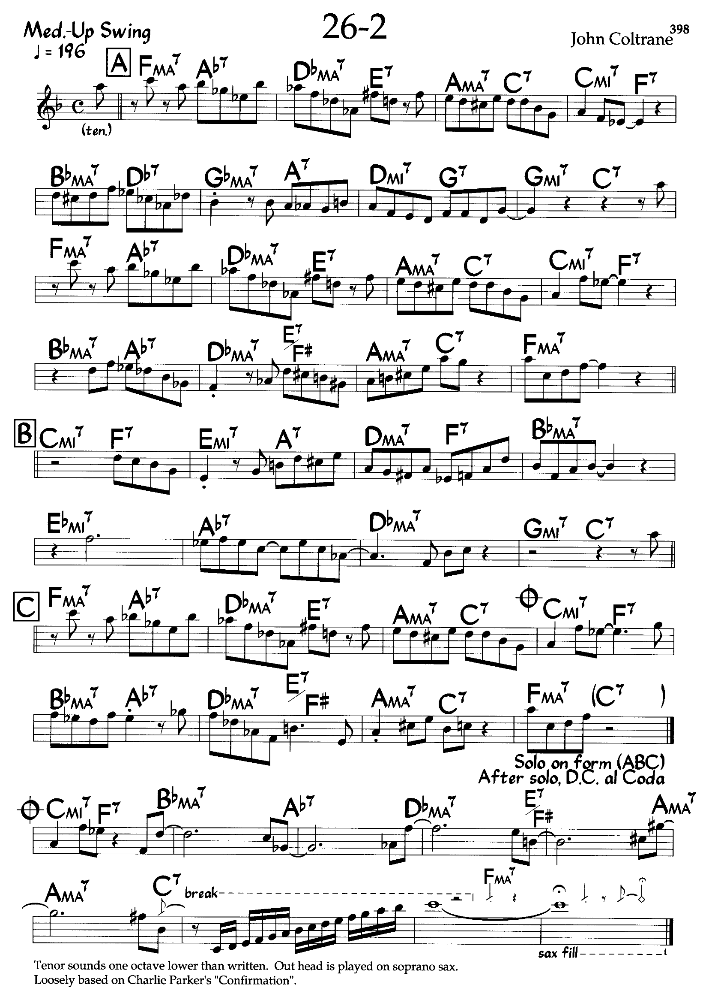

<!--
NOTE (~1 min) : Laisser l'image parler : le "mur" de chiffrages a decoder en tempo (196 a la noire),
les changes de Coltrane qui modulent par tierces. C'est la grille tombee sur P04 en condition AVEC,
l'un des deux cas a contre-sens, trop dure pour une decouverte en une seule seance.
-->

---

# Question de recherche

> Est-ce que l'usage de la réalité augmentée et diminuée sur un piano peut soutenir l'improvisation jazz mélodique dans un contexte swing ?

**L'angle d'attaque** : parmi les charges menées de front, le calcul mental de la gamme de chaque accord pèse lourd. Deux leviers permettent d'agir dessus :

- **augmenter** la réalité : éclairer les touches utiles (ajouter de l'information)
- **diminuer** la réalité : masquer les touches hors-gamme (retirer de l'information)

Contexte voulu **réaliste** : une vraie grille qui tourne, un *backing track*, plusieurs tonalités, à la différence des systèmes limités au seul do majeur.

<!--
NOTE (~2 min) : Lire la QR mère lentement, c'est le pivot de toute la présentation. Expliquer
"augmentée ET diminuée" : c'est le couple proposé par Patrick. Bien marteler "contexte réaliste",
c'est mon différenciateur par rapport à l'état de l'art (ImproVisAR = do majeur, main droite).
-->

---

# Deux sous-questions, dans cet ordre

<h3>QR1, charge cognitive (le cœur)</h3>

> L'augmentation et la diminution de la réalité aident-elles à **réduire la charge cognitive perçue** lors d'une improvisation sur une grille qui défile ?

<h3>QR2, barrière affective (le prolongement)</h3>

> En réduisant cette charge, peut-on aussi **abaisser la barrière affective** : moins d'anxiété, plus de confiance, plus d'envie d'oser ?

L'ordre encode une **chaîne causale** : QR2 n'a de sens que si QR1 tient. La baisse de charge de QR1 est l'explication attendue de l'allègement affectif de QR2.

<!--
NOTE (~2 min) : QR1 est confirmatoire et directement testable. QR2 en est le payoff logique :
décharger la mémoire ne vaut que si ça aide à franchir le pas. Préciser que ce cadrage en chaîne
est aussi notre assurance face à un petit échantillon : des effets cohérents mais faibles se lisent
comme "le mécanisme va dans le sens prédit".
-->

---

# État de l'art

<h3>Comment se travaille l'impro jazz</h3>

Revue de Spice (2010) : 5 *frameworks* (gammes, *changes*, embellissement, *patterns*, transcriptions) et une 6e catégorie créative. Thèse de Chyu (2004) pour les niveaux débutant-intermédiaire. **Les jeux proposés s'y ancrent directement.**

<h3>Les pianos augmentés</h3>

Revue de Deja et al. (2022) : sur **56** prototypes, **16** touchent l'impro, **3** seulement le jazz. Sandnes et Eika projettent des *voicings* colorés. ImproVisAR : *piano roll*, mais **do majeur seulement**. Les auteurs concluent : *"authentic improvisation studies requires further exploration"*.

<h3>Réalité diminuée et charge cognitive</h3>

Retirer du contenu perçu **réduit la charge subjective de travail** (revues 2024-2025).

<!--
NOTE (~2 min) : C'est la slide "maîtrise du domaine". Ne pas tout lire : montrer que je situe mon
travail. Le chiffre 56 / 16 / 3 justifie qu'il y a une place à prendre. ImproVisAR est le concurrent
direct dont je me démarque (do majeur). La RD est mon appui théorique pour "masquer les touches".
-->

---

# L'artefact : le principe

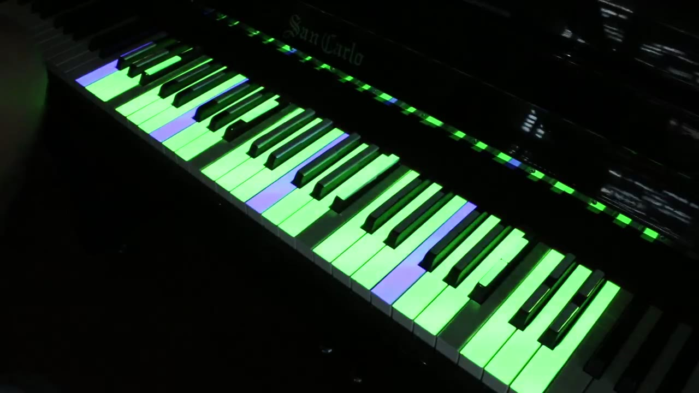

Le jeu se déroule dans une **pièce sombre**. Sans projection, le clavier devient presque invisible.

- **Réalité diminuée** : l'obscurité soustrait du champ visuel toutes les touches hors-gamme. Les notes "fausses" cessent d'exister pour l'œil, plus besoin de calculer la gamme.
- **Réalité augmentée** : le projecteur éclaire les seules touches utiles et y pose un **code couleur porteur de sens**.

**La valeur ajoutée** : une analyse harmonique **automatique**, qui déduit la *chord-scale* de chaque accord dans **toutes les tonalités**, sur n'importe quelle grille chiffrée, synchronisée à un *backing track* généré.

<!--
NOTE (~2 min) : C'est le cœur conceptuel. RD = on enlève (l'obscurité), RA = on ajoute (la lumière).
Bien dire que l'analyse harmonique automatique est la contribution clé : sans elle, il faudrait coder
la gamme de chaque accord à la main pour chaque morceau. Le vocabulaire va jusqu'aux sonorités avancées
(altérée, lydienne dominante, etc.).
-->

---

# Le système : du concept au piano

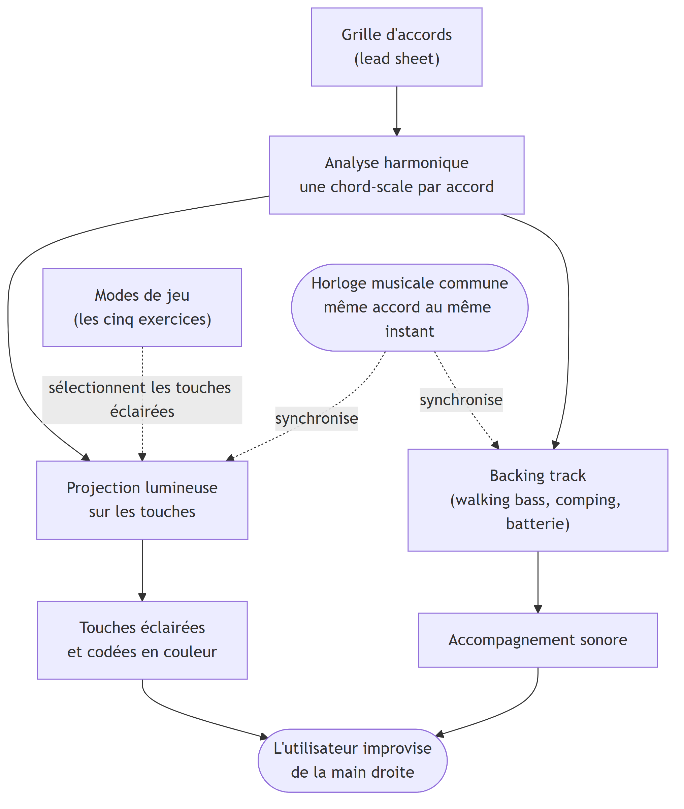

Le flux : de la grille à la touche éclairée.

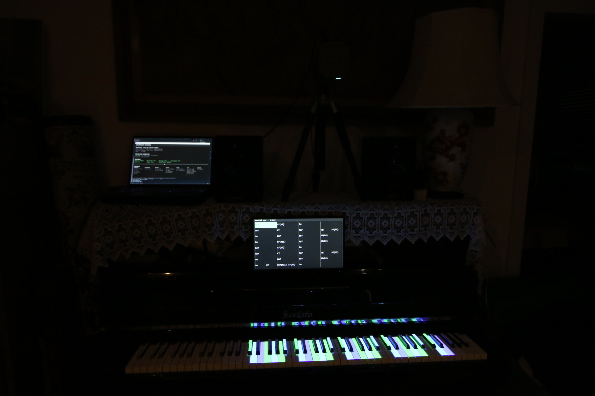

Le dispositif dans une pièce sombre.

<!--
NOTE (~1 min) : Slide de respiration, presque sans texte. À gauche, le schéma du système : la grille
est analysée, une chord-scale par accord, puis projection et backing track partent de la même horloge
musicale. À droite, le dispositif réel en pièce sombre : touches éclairées et codées, grille au pupitre
façon iReal Pro, projecteur sur trépied. Dire simplement : voilà ce qu'on vient de décrire, en vrai.
-->

---

# Le code couleur

- **vert** : la gamme de l'accord
- **bleu** : la fondamentale
- **bleu clair** : les *chord tones*
- **rouge** : *guide tone* / note de départ
- **orange** : *target note*
- **hachuré** : note à venir, instable dans l'accord courant

Réglages selon le niveau : tessiture (complet, main droite, puis 2 ou 1 octave), densité du *backing*, tempo, mode figé, et une **anticipation** qui allume l'accord suivant une croche ou une noire avant.

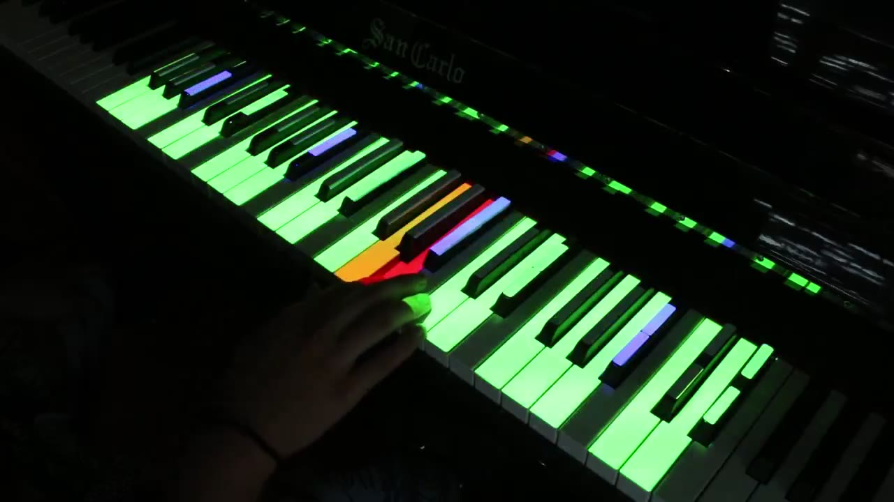

<!--
NOTE (~2 min) : Le code couleur est stable d'un mode à l'autre, ce qui permet de réinvestir ce qu'on
a appris. Photo de droite : on voit le rouge et l'orange (un jeu actif) et une main qui joue.
L'anticipation répond directement à une des charges nommées dans la QR : anticiper l'accord suivant.
-->

---

# Cinq jeux inspirés de la pédagogie jazz

- **Mode libre** : éclaire juste la *chord-scale*. Le mode d'entrée. *(cat. 1, gammes)*
- **Guide Tone** : 3ce / 7e conduites en rouge, pour des lignes qui spécifient l'harmonie, un pas vers le bebop. *(cat. 2, changes)*
- **Contour** : un échantillon lumineux de la gamme monte et descend, traçant un dessin mélodique sur une durée macro. *(cat. 6)*
- **Flow** ("gommage") : générer un flux de croches, puis prendre des silences pour ponctuer le discours. *(cat. 6)*
- **Note de début et de fin** : une note de départ (rouge) et d'arrivée (orange) par phrase, une amorce pour ceux qui bloquent sur "quoi jouer". *(cat. 6)*

<!--
NOTE (~2 min) : Ne pas tout détailler, donner la logique : chaque jeu remplace le calcul de gamme par
une contrainte de forme (contour, phrasé, note cible), donc l'attention libérée se reporte sur la ligne
mélodique. Chaque jeu est rattaché à une catégorie de la pédagogie jazz de l'état de l'art : l'artefact
reste ancré dans des méthodes existantes.
-->

---

# OMR : pourquoi des grilles saisies à la main

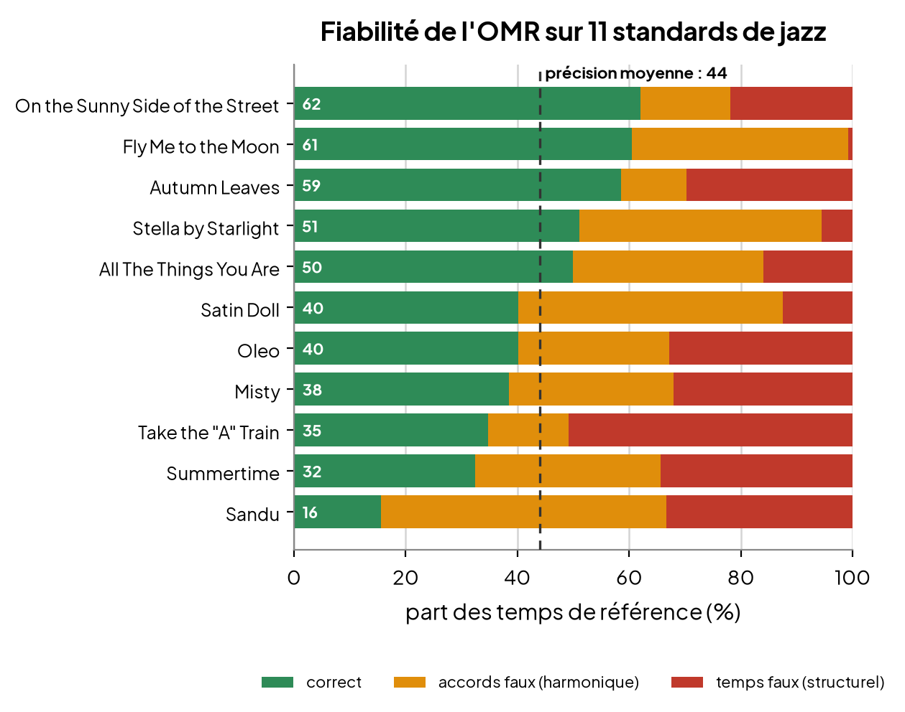

Idéalement, la leadsheet est photographiée et un module **OMR** en extrait la grille. Testé sur **11 standards** (outil de Martinez-Sevilla et al.) :

- précision moyenne : **44 / 100**
- **11 / 11** tombent sur un **mauvais nombre de temps**

Or une seule erreur de temps casse la **carrure** (un 4/4 devient 3/4) : inacceptable en apprentissage.

**Conclusion** : l'OMR est écarté, les grilles sont saisies à la main au format *.tsv*. C'est l'analyse harmonique automatique qui fait le reste.

<!--
NOTE (~2 min) : Point demandé explicitement. Le message à retenir est contre-intuitif : ce test ne
montre PAS la valeur de l'OMR, il montre qu'il est trop peu fiable, et c'est ça qui justifie de partir
de grilles à la main. Insister : saisir à la main, c'est juste écrire le chiffrage et le timing, pas
analyser l'harmonie : c'est l'artefact qui s'en charge.
-->

---

# Solution technique, en bref

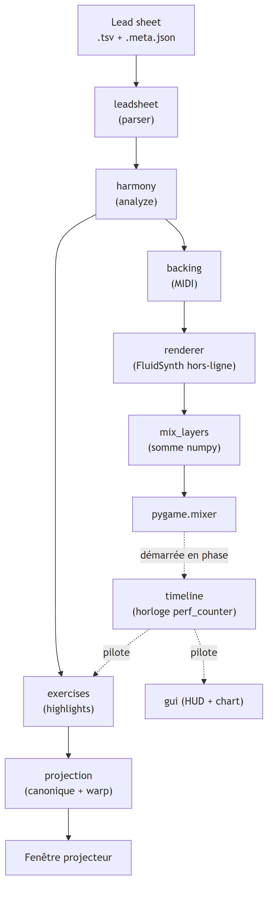

D'un *.tsv* jusqu'à la projection et au son, le long d'un pipeline de modules :

- **harmonie en Python pur** : pas de bibliothèque de théorie, une table d'accords et de l'arithmétique modulo 12
- **pygame-ce** : trois fenêtres (projection, HUD, grille), boucle 60 FPS
- **FluidSynth hors-ligne** : *backing* en **4 couches parallèles**, mixées en numpy
- **projection** : clavier canonique, puis **homographie OpenCV** (corrige l'angle du projecteur)
- **horloge murale** unique : lumières et son sur le même temps

<!--
NOTE (~1-2 min) : Volontairement bref. Le message : c'est robuste et fait maison. Insister sur deux choix :
l'analyse harmonique en Python pur (le cœur), et la projection par homographie (qui rend la calibration
possible sur n'importe quel piano droit). Le reste du détail est en backup si questions.
-->

---

# Évaluation : deux volets

Pour ancrer les tests dans la QR, **mode libre uniquement** : chaque participant joue un morceau **AVEC** projection et un **SANS** (mais avec *backing* et grille).

**Volet 1, entretien expert**
Un professeur de piano jazz : premier retour sur le système, et orientation de l'évaluation.

**Volet 2, tests participants** (**n = 8**)
- NASA-TLX, la charge cognitive (QR1)
- STAI-6, l'anxiété (QR2)
- auto-efficacité, la confiance (QR2)
- entretien semi-structuré

**À assumer** : c'est le concepteur qui a mené les tests, une seule séance, n petit. Le **protocole** et l'**outil statistique** suivent.

<!--
NOTE (~2 min) : Expliquer le within-subject AVEC/SANS : chaque personne est son propre témoin. Justifier
Wilcoxon (n=8, pas de normalité supposée). Annoncer d'emblée l'honnêteté méthodo : biais de désirabilité
(je mène les tests), une seule séance, profils non découpés. C'est la rigueur que Patrick attend.
-->

---

# Volet 1 : méthodologie de l'entretien expert

**Objectif** : obtenir un premier retour d'expert sur le système, et orienter la façon de l'évaluer. Plusieurs choix de conception en sont issus, dont l'**affichage de la grille style iReal Pro**.

Un professeur de piano jazz du **conservatoire populaire de Genève**, en **deux rencontres** :

- **27 mai** : découverte à chaud, essais avec deux de ses élèves (premier retour)
- **3 juin** : entretien **semi-structuré** (montrer, puis questionner), environ **130 min**

Format quasi libre : le professeur est largement laissé à ses digressions, avec des relances pour recentrer sur la QR.

**Traitement** : transcription via *Whisper*, puis **analyse thématique** (thème, citation, analyse, lien avec la QR). C'est l'avis d'**un seul expert** : une **validation du cadrage**, pas une mesure.

<!--
NOTE (~2 min) : Parallèle au protocole participants. Insister sur le format en 2 temps (montrer puis
questionner) et sur le quasi-libre : on suit la QR mais on laisse l'expert amener ses propres thèmes.
La première rencontre (27 mai) était trop peu structurée, d'où la seconde, qui est celle qu'on analyse.
Whisper + analyse thématique = la rigueur de traitement. Bien poser le statut : validation, pas preuve.
-->

---

# Volet 1 : ce que dit l'expert

Le thème central qui ressort, c'est la **charge cognitive**. Le professeur cherche lui-même à empêcher ses élèves de "trop réfléchir" en improvisant, et il voit dans l'artefact un moyen d'y arriver : suivre la couleur pour **"juste jouer, puis se taire"**.

- il décrit un outil **réglable**, applicable à tout niveau pourvu que la complexité soit dosée
- il lui donne une **légitimité pédagogique** (pédagogies alternatives, l'aide faite pour être retirée)
- **réserves** : "bien foutu, mais très serré", "les lumières vont beaucoup trop vite" sur les grilles chargées, d'où l'idée de **gammes passe-partout**

Le point fort : il **formule le mécanisme spontanément**, avant toute question ("c'est ce que je suis en train de dire à l'instant"). Une convergence sur l'orientation, pas une preuve de l'effet.

<!--
NOTE (~2 min) : Le point fort : le prof formule le mécanisme spontanément, AVANT ma question, donc ce
n'est pas qu'un acquiescement. Rester prudent : c'est une validation du cadrage, pas une mesure. Le
contre-risque qu'il pointe (densité trop forte = surcharge) revient dans les limites : la charge nette
dépend du dosage (tempo, densité, morceau).
-->

---

# Le protocole des tests

**Plan intra-sujet** : chaque participant est son propre témoin. Il joue **deux morceaux inconnus** de niveau équivalent, un **AVEC** projection, un **SANS** (toujours avec *backing* et grille). 14 morceaux en 4 niveaux ; ordre **contre-balancé** pour neutraliser le biais d'apprentissage.

**Déroulé d'une séance (1 h à 1 h 30, individuelle) :**

1. accueil, consentement, questionnaire initial qui fixe le niveau et les morceaux
2. explication du système et démonstration par l'expérimentateur
3. morceau A, puis NASA-TLX et questionnaire anxiété / auto-efficacité
4. morceau B (condition inverse), puis les mêmes questionnaires
5. entretien semi-structuré

Anonymat préservé : vidéos et transcriptions en local, sans API externe.

<!--
NOTE (~2 min) : Le within-subject est le point méthodo fort : chacun est son propre témoin, ça neutralise
les différences individuelles. Contre-balancement = la moitié commence AVEC, l'autre SANS. Les 2 morceaux
sont inconnus pour éviter un biais de familiarité. Mentionner le soin sur l'anonymat (éthique).
-->

---

# L'outil statistique : Wilcoxon

Test de **Wilcoxon signed-rank** (apparié) sur les différences **AVEC − SANS**.

**Pourquoi ce test**
- **n = 8**, design pré / post sur les mêmes sujets
- pas de normalité supposée des différences
- *p* **exact** calculable à n = 8

**Scores composites** (entrées du test)
- NASA-TLX : le *Raw TLX*, moyenne des 6 critères (0-100)
- STAI-6 : score total (20-80)
- auto-efficacité : moyenne des items (1-7)

**Lecture** : le *p* **bilatéral** est retenu (prudent : le contre-risque de surcharge existe), avec la taille d'effet *r* (rang-bisérial). À n = 8, *W*, *p* et *r* dérivent des **mêmes rangs** : un seul participant peut faire basculer *p*.

<!--
NOTE (~2 min) : Justifier Wilcoxon plutôt que t-test (pas de normalité, petit n). Les composites réduisent
chaque questionnaire à un score par condition. Le p bilatéral est une posture prudente : on n'exclut pas a
priori que la projection alourdisse la charge (ce qui arrive chez P04/P08). r et p viennent des mêmes rangs :
un r moyen avec un p élevé, c'est une seule information, une tendance non assurée.
-->

---

# QR1 : charge cognitive, le signal le plus net

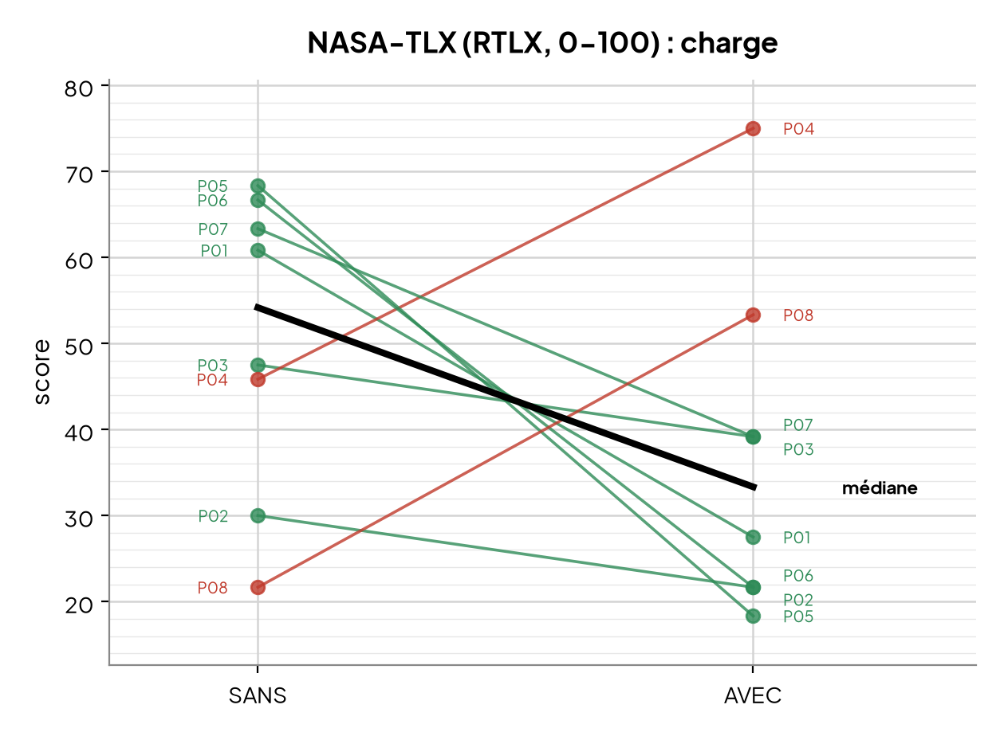

NASA-TLX (*Raw TLX*), composite AVEC vs SANS :

- **r de 0,50** en valeur absolue, dans le sens de H1 (effet large)
- **6 participants sur 8** s'orientent en faveur de H1
- l'**exigence mentale** passe de **75 à 35** en médiane

Mais **p = 0,25** : la tendance **ne** franchit **pas** le seuil de significativité.

À lire comme une **tendance de taille d'effet** en faveur de H1, pas comme une preuve. C'est néanmoins la réponse la plus solide du travail.

<!--
NOTE (~2 min) : C'est LA slide qui répond à QR1. Le 75 à 35 sur l'exigence mentale est l'indice le plus
parlant, mais c'est une médiane descriptive sur une sous-échelle, pas un test. Le composite RTLX, lui,
donne r=0.50 mais p=0.25 (n=8). Honnêteté : on ne démontre pas, on oriente. P04 et P08 vont à contre-sens.
-->

---

# QR2 : barrière affective, un signal plus faible

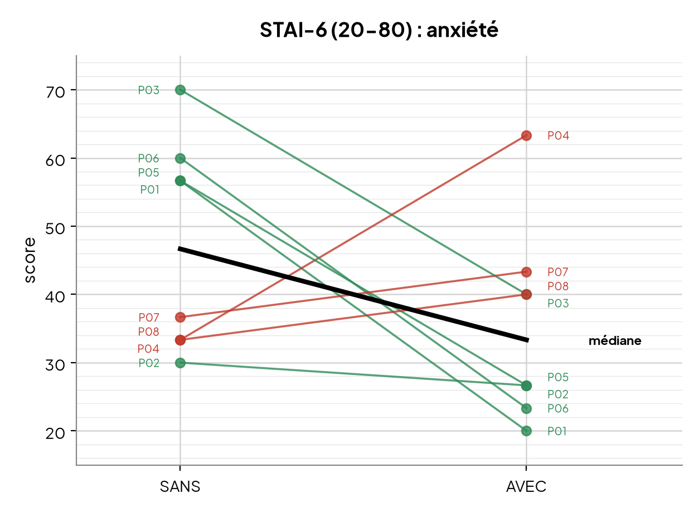

**STAI-6 (anxiété)**, r de 0,44
L'anxiété **tend à baisser**, le sentiment de sécurité ressort. P06 parle d'un **"filet qui est là"**. 5 / 8 en faveur de H1.

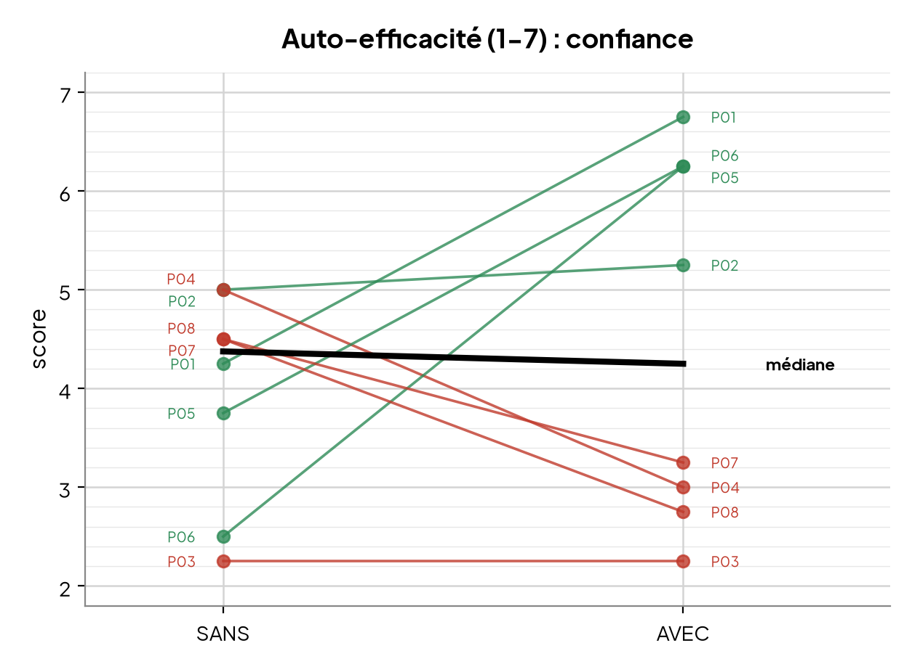

**Auto-efficacité (confiance)**, r de 0,36
La mesure la **plus faible** : médiane plate, 4 / 8 seulement. La confiance tend à monter, sans que cela soit démontré.

Aucune des deux n'est significative (*p* > 0,05). Le payoff affectif est **présent mais ténu**.

<!--
NOTE (~2 min) : QR2 est plus faible que QR1, c'est cohérent avec la chaîne causale (l'effet indirect
est plus dilué). STAI : la baisse d'anxiété, quand elle se produit, est ample (P01, P06, les plus anxieux
sans projection). Auto-efficacité : signal le plus ténu, médiane plate, à ne tenir que pour une tendance.
-->

---

# Entretiens : la table thématique

**16 thématiques**, codées par couleur (vert = positif, blanc = descriptif, rouge = négatif), lues en travers des 8 participants.

**Ce qui ressort en vert**
- facilité (6/8), charge perçue en baisse (6/7)
- sécurité (6/8), confiance et envie d'oser (6/7)
- 6/8 reprendraient la projection pour un 3e essai

**Ce qui bascule en rouge**
- partage de l'attention : le regard est soulagé, mais avec la crainte de moins s'écouter
- rétention de la musique : faible sur une séance unique

> P06 : "j'étais soulagée du poids de penser à chaque note", "un filet qui est là". P07 : "l'écoute était plus attentive sans".

Réserves récurrentes : la bichromie vert / bleu "agresse", l'auto-évaluation se partage **4 / 4**. Les améliorations convergent en **feuille de route** : annoncer le prochain accord, distinguer la fondamentale, projeter le chiffrage sur les touches.

<!--
NOTE (~2 min) : Ne pas relire les chiffres des questionnaires : ici on entre DANS la table. Les thèmes
les plus verts recoupent les questionnaires (facilité, charge, sécurité). Deux thèmes basculent en rouge,
et ils sont instructifs : le partage de l'attention (P02 "peur de moins anticiper avec l'oreille", P07/P08
écoutent mieux sans) et la rétention (séance unique). Les réserves de lisibilité (bichromie, confusion des
deux bleus de P03) et les améliorations nourrissent directement la feuille de route de la conclusion.
-->

---

# Lecture par profil, et limites

En croisant questionnaires, entretiens et avis de l'expert, les tendances **convergent** vers H1, mais avec prudence.

- les **débutants à intermédiaires** (P01, P02, P03, P05, P06) sont favorables
- les **lecteurs de grille chevronnés** (P04, P08) vont **à contre-sens** : P08 parle de **"deux systèmes cognitifs"**, P04 dit que la projection le déconcerte
- **6 sur 8** reprendraient la projection ; l'outil est vu comme une **béquille à dépasser** ("petites roues de vélo")

**Limites** : n = 8 sous-puissant, lecture par profil **post-hoc**, confondue avec l'ordre et la difficulté des morceaux (26-2, Giant Steps tombés sur la condition AVEC), biais de désirabilité.

<!--
NOTE (~2 min) : La nuance importante : l'effet moyen recouvre deux populations. Ça marche pour les
débutants-intermédiaires, ça résiste chez les chevronnés (réflexe de grille déjà automatisé qui entre
en concurrence). Mais c'est post-hoc et confondu : P04 et P08 ont eu les morceaux les plus durs sur AVEC.
À poser comme une piste, pas une conclusion.
-->

---

# Conclusion

Retour à la question de départ : la réalité augmentée et diminuée peut-elle soutenir l'improvisation jazz mélodique ?

- **QR1** (charge) : le signal est **le plus net**, tout converge vers une charge allégée (75 à 35, *r* le plus fort)
- **QR2** (affect) : **plus faible**, l'anxiété baisse et la sécurité ressort, l'auto-efficacité reste plate
- **aucune mesure n'est significative** : à n = 8, l'étude est **sous-puissante**

Le travail ne tranche pas, mais il établit la **faisabilité** et désigne l'angle le plus prometteur : **l'artefact fonctionne, il plaît, et il allège la charge pour une partie des improvisateurs.**

**Pistes** : étude mieux dimensionnée, désétayage progressif, illumination des seules cadences pour les avancés, OMR fiabilisé, couche main gauche (*voicings*).

<!--
NOTE (~2 min) : Boucler sur la QR. Message honnête et assumé : pas de preuve statistique, mais une
faisabilité démontrée et un angle clair. Finir large : augmenter et diminuer la réalité d'un instrument,
au moment où on en joue, est une voie sérieuse au-delà du seul piano jazz. Merci, et place aux questions.
-->

---

<!-- _class: invert -->
<!-- _footer: '' -->

# Démonstration

Le système sur un vrai piano, environ 5 minutes

<!--
NOTE : Basculer sur la vidéo proto-media/5. video demo V2/demo-2026-05-26.mp4 (6:14, en couper environ 5 min).
Montrer : pièce sombre, la grille qui défile, le mode libre, un jeu (contour ou guide tone), le backing track.
C'est la dernière partie de la présentation, juste avant les questions.
-->

---

<!-- _class: lead -->
<!-- _paginate: false -->
<!-- _footer: '' -->

# Merci

Questions ?

Alexandre Riedo, alexandreriedopro@gmail.com

<!--
NOTE : Slides de réserve possibles pour le Q&A (à ajouter si besoin) : l'architecture technique (pipeline
8 modules), la construction du backing track (walking bass / comping / batterie), la calibration par
homographie, le barème de la distance harmonique OMR, le tableau des rangs de Wilcoxon.
-->
